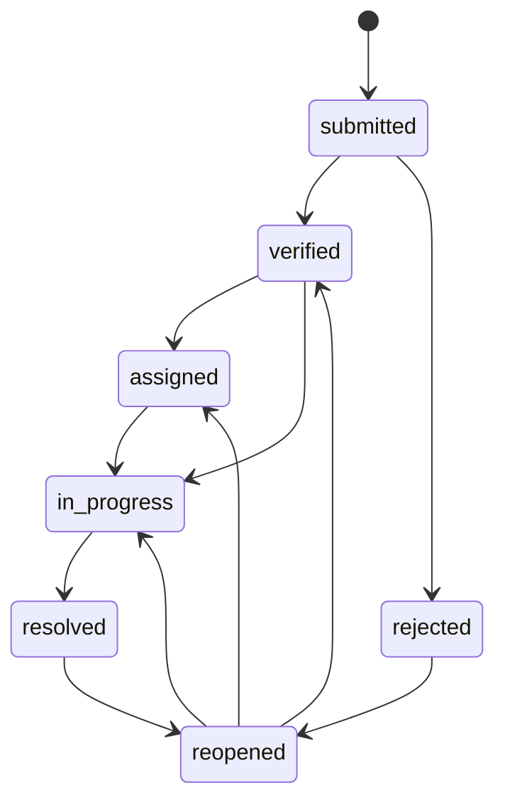

# WardSetu Backend — API Specification

## Document control

| Field              | Value                                                                                                                                                                                                                                                                            |
| ------------------ | -------------------------------------------------------------------------------------------------------------------------------------------------------------------------------------------------------------------------------------------------------------------------------- |
| Status             | Documentation only. No API, database, Prisma, migration, or service code has been implemented from this document.                                                                                                                                                                |
| Source             | WardConnect — Backend Schema & API Specification, **Version 6.0 (Consolidated Edition)**, 17 Sep 2026                                                                                                                                                                            |
| Companion document | [`docs/DATABASE_ARCHITECTURE.md`](./DATABASE_ARCHITECTURE.md) — same source spec, data-model angle. This document is the API-contract angle. Table names, role names and permission keys must stay identical between the two; if they ever diverge, that is a documentation bug. |
| Audience           | Shared contract between the WardSetu backend and WardSetu frontend teams.                                                                                                                                                                                                        |

> **Note on the requesting instruction's version label.** The task that produced this document referred to the source as "v5.0 (Consolidated Edition)." The attached file's own title page and changelog state **"Version 6.0 (Consolidated Edition)," dated 17 Sep 2026**, opening with "What changed in v6.0: six further open questions resolved…". A byte-for-byte comparison confirms this file is identical to the v6.0 document already reflected in `docs/DATABASE_ARCHITECTURE.md` and `CLAUDE.md`. This document therefore documents the actual v6.0 content, not a v5.0 document — flagged here rather than silently relabelled.

Per standing instruction, this file preserves the v6.0 document's terminology and decisions exactly. It does not invent endpoints, fields, permissions, or behavior beyond what the source states, and it flags rather than resolves any ambiguity the source itself leaves open.

---

## 1. OpenAPI / Swagger requirement — source of truth policy

This section is required by the frontend/backend team agreement and is **not** taken from the v6.0 specification text (the source document does not describe an OpenAPI workflow); it states the policy this document operates under.

**OpenAPI/Swagger is the executable API source of truth.** This markdown document is a narrative companion to it, not a replacement for it. Concretely:

- Every new API endpoint must be added to the OpenAPI/Swagger specification.
- Every modification to an existing API must update its OpenAPI/Swagger documentation.
- Request bodies, response schemas, parameters, authentication requirements, status codes, and error responses must remain synchronized with OpenAPI/Swagger.
- Generated API documentation and generated client types must be regenerated/updated from the OpenAPI specification whenever it changes.
- An API change is **not** considered complete if the corresponding Swagger/OpenAPI documentation is missing or outdated.

**Current state (flagged, not invented):** as of this document, no backend code, routes, or OpenAPI/Swagger definition exist yet (see `docs/DATABASE_ARCHITECTURE.md` §3 "Implementation status" — nothing has been implemented). This document is therefore the pre-implementation contract; once endpoint implementation begins, the OpenAPI spec becomes authoritative for exact request/response shapes, and this document should be read as the narrative index into it, updated to match whenever the two would otherwise drift.

---

## 2. Global API conventions

Stated verbatim in the source (§8, closing line):

> Success returns `{data, meta?}`; errors return `{error:{code,message,details?}, requestId}`. Lists use cursor pagination. Dates are ISO-8601 UTC. OpenAPI is the source of truth.

Breaking this down (no shape beyond what the source states is invented):

- **Success envelope:** `{ data, meta? }`. The source does not specify the internal shape of `data` or `meta` beyond this; those are left to the OpenAPI specification once endpoints are implemented.
- **Error envelope:** `{ error: { code, message, details? }, requestId }`. The source does not enumerate specific `code` values or the shape of `details`; not invented here.
- **Pagination:** list endpoints use cursor pagination. The source does not state the cursor parameter name(s) or page-size defaults; not invented here — defer to the OpenAPI specification.
- **Dates/times:** all dates are ISO-8601, UTC. Per §7 "Indexes" (closing line): "UTC timestamps in the database; render in Asia/Kolkata (and locale) in the UI." — i.e. the API layer transmits UTC; locale rendering is a client concern.
- **Authorization enforcement:** "Enforced server-side only; client-side filtering is never a security control." (§4.4, closing paragraph, and reiterated as a non-negotiable design principle in §10). Frontend permission-based UI is UX only, never an authorization boundary — consistent with the WardSetu frontend `CLAUDE.md` rule "Frontend permissions are UX, not authorization."

---

## 3. Authentication & Profile APIs

Source: §8.1.

| Method | Endpoint                       | Purpose                                                                       |
| ------ | ------------------------------ | ----------------------------------------------------------------------------- |
| POST   | `/auth/otp/request`            | Request challenge                                                             |
| POST   | `/auth/otp/verify`             | Verify and create session (also creates the citizen row on first login, §4.1) |
| POST   | `/auth/refresh`                | Rotate refresh token                                                          |
| POST   | `/auth/logout`                 | Revoke session                                                                |
| GET    | `/me`                          | Current user                                                                  |
| PATCH  | `/me`                          | Update profile                                                                |
| POST   | `/me/consent`                  | Record consent grant                                                          |
| GET    | `/me/consent`                  | Consent history                                                               |
| POST   | `/me/data-deletion-request`    | Initiate deletion                                                             |
| GET    | `/me/data-deletion-request`    | Status                                                                        |
| POST   | `/me/devices`                  | Register device                                                               |
| DELETE | `/me/devices/:id`              | De-register device                                                            |
| GET    | `/me/notification-preferences` | Get preferences                                                               |
| PATCH  | `/me/notification-preferences` | Update preferences                                                            |

**Behavioral notes tied to this group (verbatim from source, not invented):**

- `POST /auth/otp/verify` is the sole path that auto-creates a `user_ward_roles` row: "A `user_ward_roles` row with `role='citizen'` (all scope columns NULL) is created automatically for every user at account creation (first successful OTP verify) — the only automatically-created row; every other role is explicitly granted." (§4.1)
- **Existing-user backfill (v6.0, resolved):** users created _before_ this rule shipped have no `user_ward_roles` row at all. Since authorization requires one to resolve permissions with no implicit fallback, a one-off idempotent backfill migration inserts a citizen row for every existing `user_id` lacking one, run once immediately after the `user_ward_roles` migration and before deploying application code that assumes every user has a row (§4.1, "Migration note"). This is a deployment/migration concern, not an API endpoint, but it directly affects what `GET /users/:id/permissions` (§6) returns for pre-existing accounts until the backfill runs.

---

## 4. Location Hierarchy APIs

Source: §8.2, read together with §2 (Location & Administrative Hierarchy).

| Method | Endpoint                | Purpose                   |
| ------ | ----------------------- | ------------------------- |
| GET    | `/states`               | List states               |
| GET    | `/states/:id/districts` | Districts in a state      |
| GET    | `/districts/:id/cities` | Cities/ULBs in a district |
| GET    | `/cities/:id/wards`     | Wards in a city           |
| GET    | `/wards`                | List wards                |
| GET    | `/wards/:id`            | Public ward profile       |
| GET    | `/wards/:id/localities` | Localities                |

The hierarchy is `State → District → City/ULB → Ward → Locality`, each level normalized in its own table and carrying an `lgd_code` for reconciliation against the official Local Government Directory (lgdirectory.gov.in) (§2). None of these endpoints require authentication per the source text (they are listed without a stated auth requirement); not invented — treat as public/read endpoints unless the OpenAPI spec states otherwise.

---

## 5. Ward Representative, Election-Term & Office-User APIs

Source: §8.3, read together with §3 (Ward Representatives, Election Terms & Office Users) and §3.6.

| Method | Endpoint                                         | Purpose                                                                                              |
| ------ | ------------------------------------------------ | ---------------------------------------------------------------------------------------------------- |
| GET    | `/wards/:id/representative`                      | Public councillor profile (current term)                                                             |
| GET    | `/wards/:id/representative/history`              | Past representatives                                                                                 |
| GET    | `/wards/:id/elections/terms`                     | Full election-term history                                                                           |
| GET    | `/wards/:id/elections/terms/:termId`             | One term's detail                                                                                    |
| POST   | `/wards/:id/elections/new-term`                  | Record a new election result — explicit `representative_profile_id` OR `new_profile`, never inferred |
| POST   | `/wards/:id/elections/close-term`                | Explicit early close                                                                                 |
| GET    | `/representative-profiles?search=`               | Look up an existing profile before deciding new-term mode                                            |
| GET    | `/representative-profiles/:id`                   | A person's full representation history                                                               |
| GET    | `/wards/:id/representative/office-users`         | List active office users                                                                             |
| POST   | `/wards/:id/representative/office-users`         | Grant `ward_rep_office` access (reduced permission set, §4.4)                                        |
| DELETE | `/wards/:id/representative/office-users/:userId` | Revoke before term end                                                                               |

**§3.6 — recording an election result: explicit identity, never inferred.** `POST /wards/:id/elections/new-term` accepts exactly two mutually exclusive modes, verbatim:

| Mode                                              | Behaviour                                                                                                                                                                                          |
| ------------------------------------------------- | -------------------------------------------------------------------------------------------------------------------------------------------------------------------------------------------------- |
| `representative_profile_id` (existing person)     | Used for any re-appearance of a known person. The new `ward_representative_terms` row points at this existing profile; nothing about the profile (including `linked_user_id`) is touched.          |
| `new_profile: {full_name, …}` (never seen before) | Creates a fresh `representative_profiles` row. If the submitted contact details match an existing profile's linked user, the API rejects with a **409** rather than silently creating a duplicate. |

"The API never guesses by matching name or mobile number." `GET /representative-profiles?search=` exists specifically so an admin can find the correct existing profile first, rather than the server inferring it.

**§3.5 — election-day effects** (not endpoints, but behavior triggered by the above endpoints and relevant to what callers should expect):

| Data                                                                               | On election day                                                                         |
| ---------------------------------------------------------------------------------- | --------------------------------------------------------------------------------------- |
| Issues, updates, events, schemes, library, opportunities, localities, departments  | Unchanged, untouched, never migrated or duplicated — belongs to the ward, permanently.  |
| The outgoing `ward_representative_terms` row                                       | `is_current` set to false. Kept forever (history).                                      |
| The outgoing `representative_office_users` grants and their `user_ward_roles` rows | Both actively revoked in the same transaction.                                          |
| The `representative_profiles` row                                                  | Reused if the same person won again; untouched (not deleted) if a different person won. |
| `report_snapshots`                                                                 | Carries an optional `election_term_id` FK for by-term comparison.                       |

**Flagged, not resolved (carried over from `docs/DATABASE_ARCHITECTURE.md` §7.3/§17.3):** the v5.0 endpoint list included `PUT /wards/:id/representative`, marked deprecated. The v6.0 §8.3 endpoint list above no longer lists it, with no changelog entry announcing its removal. The source does not state whether this is an intentional removal or a silent listing omission. This document does not invent a resolution — treat the endpoint as still deprecated-but-possibly-present until confirmed either way; do not build new frontend or backend logic against it.

**Recording new office-user access** (`POST /wards/:id/representative/office-users`) grants the `ward_rep_office` role, which as of v6.0 carries the narrowed permission set described in §8 below — this is not a plain "add a team member" grant; it is scoped by `ward_representative_term_id` per the `representative_office_users` table definition.

---

## 6. Team, Roles & Permissions APIs

Source: §8.6, read together with §4 (Authorization: Roles & Permissions).

| Method | Endpoint                                      | Purpose                                                    |
| ------ | --------------------------------------------- | ---------------------------------------------------------- |
| GET    | `/team`                                       | Team                                                       |
| POST   | `/team/invite`                                | Add team member                                            |
| PATCH  | `/team/:userId/role`                          | Change role                                                |
| GET    | `/team/invites/:token`                        | Preview a pending invite                                   |
| POST   | `/team/invites/:token/accept`                 | Accept invite                                              |
| GET    | `/roles`                                      | List all roles                                             |
| GET    | `/permissions`                                | Full permissions catalog                                   |
| GET    | `/roles/:key/permissions`                     | Platform-default permissions for a role                    |
| PATCH  | `/roles/:key/permissions`                     | Platform admin adjusts a role's platform default (audited) |
| GET    | `/wards/:id/role-permission-overrides`        | A ward's current policy deviations                         |
| POST   | `/wards/:id/role-permission-overrides`        | Set a ward-level grant/deny for a role + permission        |
| DELETE | `/wards/:id/role-permission-overrides/:id`    | Remove a ward-level override                               |
| GET    | `/users/:id/permissions`                      | Effective permissions for a user (all tiers resolved)      |
| POST   | `/users/:id/permission-overrides`             | Grant/deny a permission for a specific user                |
| DELETE | `/users/:id/permission-overrides/:overrideId` | Remove a user-level override                               |

`GET /users/:id/permissions` is the endpoint consumers should call to get a fully-resolved permission set for a user — it is explicitly "all tiers resolved," i.e. it applies the three-tier precedence described in §8.9 below server-side, so API consumers never need to (and must not) re-implement that resolution logic client-side.

### 6.1 Permissions catalog (complete, verbatim)

| Module    | Permission keys                                                                                                                                                                                 |
| --------- | ----------------------------------------------------------------------------------------------------------------------------------------------------------------------------------------------- |
| issues    | `issues:create`, `issues:verify`, `issues:assign`, `issues:resolve`, `issues:reject`, `issues:reopen`, `issues:rate`, `issues:link`, `issues:escalate`                                          |
| content   | `content:draft`, `content:publish`                                                                                                                                                              |
| community | `ideas:moderate`, `polls:manage`                                                                                                                                                                |
| team      | `team:invite`, `team:manage_roles`, `team:remove`                                                                                                                                               |
| ward      | `ward:configure`, `ward:view_analytics`, `ward:manage_departments`, `ward:manage_categories`                                                                                                    |
| elections | `elections:manage`, `representative_office:manage`                                                                                                                                              |
| reports   | `reports:export`, `audit:view`                                                                                                                                                                  |
| ulb       | `ulb:manage_wards`, `ulb:manage_admins`, `ulb:view_analytics`                                                                                                                                   |
| district  | `district:manage_ulbs`, `district:manage_admins`, `district:view_analytics`                                                                                                                     |
| state     | `state:manage_districts`, `state:manage_admins`, `state:view_analytics`                                                                                                                         |
| platform  | `wards:create`, `location_hierarchy:manage`, `feature_flags:manage_platform`, `feature_flags:manage_ward`, `escalation_rules:manage`, `escalation_rules:manage_platform_defaults` (new in v6.0) |

Clarification stated in the source (§4.3, closing line): `state:manage_districts` / `district:manage_ulbs` / `ulb:manage_wards` mean managing the **admin appointments** at the level below — not editing the states/districts/cities master records themselves (that is `location_hierarchy:manage`, `platform_admin` only).

### 6.2 Role capability summary (platform default, concrete permissions, no wildcards)

Verbatim from §4.4:

| Role                | `role_permissions` default (concrete keys)                                                                                                                                                                                                                                                                                                                                                                                                                                                                                                                                                                        |
| ------------------- | ----------------------------------------------------------------------------------------------------------------------------------------------------------------------------------------------------------------------------------------------------------------------------------------------------------------------------------------------------------------------------------------------------------------------------------------------------------------------------------------------------------------------------------------------------------------------------------------------------------------- |
| Citizen             | `issues:create`, `issues:rate`. (Voting/submitting ideas/RSVP are open to any authenticated citizen — not permission-gated.)                                                                                                                                                                                                                                                                                                                                                                                                                                                                                      |
| Ward staff          | `issues:verify`, `content:draft`.                                                                                                                                                                                                                                                                                                                                                                                                                                                                                                                                                                                 |
| Ward representative | `issues:create`, `issues:verify`, `issues:assign`, `issues:resolve`, `issues:reject`, `issues:reopen`, `issues:link`, `issues:escalate`, `content:draft`, `ideas:moderate`, `polls:manage`, `team:invite`, `team:manage_roles`, `team:remove`, `ward:configure`, `ward:view_analytics`, `ward:manage_departments`, `ward:manage_categories`, `feature_flags:manage_ward`, `escalation_rules:manage` (own ward only), `reports:export`, `audit:view`, `elections:manage`, `representative_office:manage`. Does **not** include `content:publish` by default — a ward opts in via `ward_role_permission_overrides`. |
| Ward rep office     | The **same set** as Ward representative, **minus** `team:invite`, `team:manage_roles`, `team:remove`, `representative_office:manage`, and `elections:manage`. Office staff run day-to-day ward operations on the representative's behalf, but decisions about who has dashboard access and who the representative even is remain with the elected person or Ward admin — narrowed in v6.0 to close a privilege-escalation path.                                                                                                                                                                                   |
| Ward admin          | Everything Ward representative has, **plus** `content:publish`.                                                                                                                                                                                                                                                                                                                                                                                                                                                                                                                                                   |
| ULB admin           | `ulb:manage_wards`, `ulb:manage_admins`, `ulb:view_analytics` (cascades to every ward in their city, §8.9.1)                                                                                                                                                                                                                                                                                                                                                                                                                                                                                                      |
| District admin      | `district:manage_ulbs`, `district:manage_admins`, `district:view_analytics` (cascades to every ULB/ward in their district)                                                                                                                                                                                                                                                                                                                                                                                                                                                                                        |
| State admin         | `state:manage_districts`, `state:manage_admins`, `state:view_analytics` (cascades to every district/ULB/ward in their state)                                                                                                                                                                                                                                                                                                                                                                                                                                                                                      |
| Platform admin      | Every permission in the catalog, unconditionally, including `escalation_rules:manage_platform_defaults`.                                                                                                                                                                                                                                                                                                                                                                                                                                                                                                          |

### 6.3 Corrected worked example — ward-level publish override (v6.0 fix)

Stated in the source as a correction to a prior contradiction, reproduced because it is the canonical example of how `ward_role_permission_overrides` is meant to be used by API consumers:

> `role_permissions` does NOT grant `ward_representative` `content:publish` by default (Ward admin has it; Ward representative does not). A ward that wants its representative to publish directly, rather than routing every notice through a Ward admin, inserts a `ward_role_permission_overrides` row: `{ward_id: 12, role_key: 'ward_representative', permission_id: content:publish, effect: 'grant'}`. Now every `ward_representative` in Ward 12, including whoever wins the next election, can publish directly, until the ward removes the override. This is an opt-IN by a ward, not an opt-out — consistent with the platform-wide default being the more conservative, accountability-preserving choice.

This is created/removed via `POST /wards/:id/role-permission-overrides` and `DELETE /wards/:id/role-permission-overrides/:id` respectively.

### 6.4 `ward_rep_office` narrowing rationale (v6.0 fix, security-relevant for API consumers)

> `ward_rep_office` previously inherited the exact same permission set as `ward_representative` — including `team:manage_roles`, `team:remove`, `representative_office:manage`, and `elections:manage`. Confirmed as a genuine risk: an office staff account (a PA or secretary, explicitly NOT the elected person) could grant itself or a colleague higher access, remove another team member, or even record an election result, none of which should be delegable to office staff.
> Resolution: `ward_rep_office` now excludes `team:invite`, `team:manage_roles`, `team:remove`, `representative_office:manage`, and `elections:manage` from its default set. Everything else — issue handling, content drafting, ward-facing operational permissions — remains. A ward that genuinely wants to delegate more can still do so per-person via `user_permission_overrides`, which keeps that decision individually accountable rather than a blanket default for every office account.

### 6.5 Escalation-rule permission split (v6.0 fix, security-relevant for API consumers)

> `escalation_rules.ward_id` NULL marks a platform-wide default rule applying to every ward that has no rule of its own — but the existing `escalation_rules:manage` permission was granted to Ward admin with no scoping statement, meaning any `ward_admin` could, as written, edit the platform-wide default and change escalation behaviour for every other ward in the country.
> Resolution, following the exact pattern already used for feature flags (`feature_flags:manage_platform` vs `feature_flags:manage_ward`): `escalation_rules:manage` is now explicitly scoped — it only authorizes managing rows where `escalation_rules.ward_id` equals the caller's own ward. A new, separate permission, `escalation_rules:manage_platform_defaults`, governs rows where `ward_id IS NULL`, and is granted to `platform_admin` only.

This is directly reflected in the two escalation-rule endpoints under §7 below: `POST /escalation-rules` (ward-scoped) vs. `POST /escalation-rules/platform-default` (platform-only).

---

## 7. Issues and Issue Workflow APIs

Source: §8.4, read together with §9 (Issue State Machine).

| Method | Endpoint                             | Purpose                                                                                                                             |
| ------ | ------------------------------------ | ----------------------------------------------------------------------------------------------------------------------------------- |
| GET    | `/issues`                            | Scoped list                                                                                                                         |
| POST   | `/issues`                            | Create issue                                                                                                                        |
| GET    | `/issues/:id`                        | Detail                                                                                                                              |
| POST   | `/issues/:id/media`                  | Media                                                                                                                               |
| POST   | `/issues/:id/follow-up`              | Citizen follow-up                                                                                                                   |
| POST   | `/issues/:id/verify`                 | Verify                                                                                                                              |
| POST   | `/issues/:id/assign`                 | Assign                                                                                                                              |
| POST   | `/issues/:id/forward`                | Record department reference                                                                                                         |
| POST   | `/issues/:id/progress`               | Progress note                                                                                                                       |
| POST   | `/issues/:id/resolve`                | Resolve                                                                                                                             |
| POST   | `/issues/:id/reopen`                 | Reopen                                                                                                                              |
| POST   | `/issues/:id/rate`                   | Citizen rates 1–5                                                                                                                   |
| POST   | `/issues/:id/link`                   | Mark duplicate/related                                                                                                              |
| GET    | `/issues/:id/links`                  | Linked issues                                                                                                                       |
| DELETE | `/issues/:issueId/links/:linkId`     | Remove a link                                                                                                                       |
| GET    | `/escalation-rules`                  | List rules (ward-scoped, falls back to the platform default)                                                                        |
| POST   | `/escalation-rules`                  | Create/update a ward-scoped rule (`escalation_rules:manage`)                                                                        |
| POST   | `/escalation-rules/platform-default` | Create/update the platform-wide default rule (`escalation_rules:manage_platform_defaults`, `platform_admin` only) — **new in v6.0** |
| GET    | `/issues/:id/escalations`            | Escalation history                                                                                                                  |

### 7.1 Issue state machine (§9, verbatim)

| Current     | Allowed next                    |
| ----------- | ------------------------------- |
| submitted   | verified, rejected              |
| verified    | assigned, in_progress           |
| assigned    | in_progress                     |
| in_progress | resolved                        |
| resolved    | reopened                        |
| reopened    | verified, assigned, in_progress |
| rejected    | reopened                        |

**Transactional rule (verbatim):** "Status change + `issue_event` + `audit_log` commit in one transaction. `issue_ratings` and `issue_escalations` are side records, not states." — i.e. `POST /issues/:id/verify`, `/assign`, `/resolve`, `/reopen`, etc. must each atomically write the new `issues.status`, an `issue_events` row, and an `audit_logs` row; `POST /issues/:id/rate` and the escalation-related endpoints do not change the issue's state-machine status.

### 7.2 Escalation rules — ward-scoped vs. platform-wide

`GET /escalation-rules` is ward-scoped and "falls back to the platform default" when the ward has no rule of its own — reflecting `escalation_rules.ward_id NULL` meaning "platform-wide default" (§6). Write access is split per §6.5 above: `POST /escalation-rules` requires `escalation_rules:manage` and only authorizes the caller's own ward; `POST /escalation-rules/platform-default` requires `escalation_rules:manage_platform_defaults` and is `platform_admin`-only.

---

## 8. Content & Community APIs

Source: §8.5.

| Method | Endpoint               | Purpose            |
| ------ | ---------------------- | ------------------ |
| GET    | `/updates`             | Public updates     |
| POST   | `/updates`             | Create update      |
| PATCH  | `/updates/:id`         | Edit               |
| POST   | `/updates/:id/publish` | Publish            |
| GET    | `/events`              | Events             |
| POST   | `/events`              | Create event       |
| POST   | `/events/:id/rsvp`     | RSVP               |
| GET    | `/schemes`             | Schemes            |
| POST   | `/schemes`             | Create scheme      |
| GET    | `/library`             | Library            |
| POST   | `/library`             | Create item        |
| GET    | `/opportunities`       | Opportunities      |
| POST   | `/opportunities`       | Create opportunity |
| GET    | `/ideas`               | Ideas              |
| POST   | `/ideas`               | Submit idea        |
| POST   | `/ideas/:id/vote`      | Upvote             |
| GET    | `/polls`               | Polls              |
| POST   | `/polls`               | Create poll        |
| POST   | `/polls/:id/vote`      | Vote               |

Per §4.4: "Voting/submitting ideas/RSVP are open to any authenticated citizen — not permission-gated." This applies to `POST /ideas`, `POST /ideas/:id/vote`, `POST /events/:id/rsvp`, and `POST /polls/:id/vote` — these do not require a specific permission key beyond authentication. `POST /updates` and `POST /updates/:id/publish` are gated by `content:draft` and `content:publish` respectively (see §6.2/§6.3 above for who holds `content:publish` by default).

---

## 9. Location-Tiered Administration APIs

Source: §8.7, read together with §4.2 and §4.2.1.

| Method | Endpoint                                          | Purpose                                                                              |
| ------ | ------------------------------------------------- | ------------------------------------------------------------------------------------ |
| GET    | `/states/:id/admins`                              | List state_admins                                                                    |
| POST   | `/states/:id/admins`                              | Platform admin appoints a state_admin                                                |
| GET    | `/districts/:id/admins`                           | List district_admins                                                                 |
| POST   | `/districts/:id/admins`                           | State admin appoints a district_admin                                                |
| GET    | `/cities/:id/admins`                              | List ulb_admins                                                                      |
| POST   | `/cities/:id/admins`                              | District admin appoints a ulb_admin                                                  |
| DELETE | `/{states\|districts\|cities}/:id/admins/:userId` | Revoke a tiered-admin appointment                                                    |
| GET    | `/{states\|districts\|cities}/:id/analytics`      | Aggregated analytics, cascading down the hierarchy from this scope — **new in v6.0** |

### 9.1 Appointment chain (§4.2, verbatim)

`platform_admin` appoints `state_admin` → `state_admin` appoints `district_admin` → `district_admin` appoints `ulb_admin` → `ulb_admin` appoints `ward_admin`.

| Role           | Required scope column           | Appoints                                          |
| -------------- | ------------------------------- | ------------------------------------------------- |
| state_admin    | `state_id` (all others NULL)    | `district_admin` for districts within their state |
| district_admin | `district_id` (all others NULL) | `ulb_admin` for cities within their district      |
| ulb_admin      | `city_id` (all others NULL)     | `ward_admin` for wards within their city          |

Note: `ward_admin` appointment itself is not listed among the §8.7 endpoints above — the source's §8.7 table only shows appointment endpoints through `ulb_admin` (`/cities/:id/admins`). The source does not state a `/wards/:id/admins` endpoint for appointing `ward_admin`. This is not invented here; flagged as an apparent gap consistent with `docs/DATABASE_ARCHITECTURE.md`'s treatment of open items — the appointment mechanism for `ward_admin` is not specified at the API layer in this document.

### 9.2 How tiered access cascades (§4.2.1, v6.0 resolution — this governs `GET /{states|districts|cities}/:id/analytics` and every `manage_*` admin endpoint above)

| Permission shape                                  | Behaviour                                                                                                                            | Example                                                                                                                                                                                                                                                                                             |
| ------------------------------------------------- | ------------------------------------------------------------------------------------------------------------------------------------ | --------------------------------------------------------------------------------------------------------------------------------------------------------------------------------------------------------------------------------------------------------------------------------------------------- |
| `view_analytics` (read-only oversight)            | **Cascades down automatically.** Holding it at a tier grants read access to aggregated data for that tier and everything beneath it. | A `state_admin`'s `state:view_analytics` lets them see roll-up figures for every district, ULB and ward in their state — no separate grant needed per ward.                                                                                                                                         |
| `manage_*` (an operational or appointment action) | **Does not cascade.** It authorizes acting at exactly the admin's own tier, never several levels down.                               | `district:manage_ulbs` lets a `district_admin` appoint/remove `ulb_admin` for cities in their district. It does NOT let them directly create a ward or publish ward content — that remains `ulb_admin`'s and `ward_admin`'s job, reached by appointing the right person, not by reaching past them. |

Mechanically (verbatim): "a request scoped to ward W is authorized if the caller has a matching role at ANY level of W's ancestor chain (ward → city → district → state) whose permission is a cascading (`view_analytics`-shaped) one, resolved by walking that chain — not by an exact scope-column match. A `manage_*`-shaped permission, by contrast, is only ever checked for an EXACT match against the caller's own scope column. `wards:create` (`platform_admin`, any city) and `ulb:manage_wards` (`ulb_admin`, their own city only) are two distinct permissions for this reason — `POST /cities/:id/wards` accepts either, checked independently, never by walking up from `platform_admin` to 'cover' a `ulb_admin`'s narrower grant or vice versa."

**Note:** `POST /cities/:id/wards` is referenced in the §4.2.1 authorization example above but is **not** listed in the §8 endpoint tables (location endpoints in §8.2 are all `GET`). The source does not otherwise describe ward-creation endpoints. Not invented here — flagged as an apparent gap; a ward-creation write endpoint exists conceptually (per this authorization example and per `wards:create` in the platform permissions module) but its exact route is not stated in the endpoint tables the source provides.

---

## 10. Reports, Audit, Feature Flags & Health APIs

Source: §8.8.

| Method | Endpoint                        | Purpose                                       |
| ------ | ------------------------------- | --------------------------------------------- |
| GET    | `/reports/monthly`              | Monthly report                                |
| GET    | `/reports/export.csv`           | Issue CSV                                     |
| GET    | `/audit`                        | Audit                                         |
| GET    | `/feature-flags`                | Effective feature flags for the caller's ward |
| PATCH  | `/wards/:id/feature-flags/:key` | Ward admin toggles a flag for their ward      |
| GET    | `/health`                       | Health                                        |

`reports:export` and `audit:view` gate `/reports/export.csv` and `/audit` respectively per the permissions catalog (§6.1); `feature_flags:manage_ward` gates `PATCH /wards/:id/feature-flags/:key`, and `feature_flags:manage_platform` (not exposed as a listed endpoint here — see gaps note below) governs the platform-wide flag defaults.

**Flagged, not resolved:** the permissions catalog (§6.1) includes `feature_flags:manage_platform`, mirroring the escalation-rule ward/platform split pattern, but no `PATCH` endpoint for the platform-wide feature-flag default is listed in §8.8 (only the ward-scoped `PATCH /wards/:id/feature-flags/:key` appears). The source does not state how a `platform_admin` sets the platform-wide default via the API. Not invented here.

---

## 11. Authorization / Permission Resolution Rules Relevant to API Consumers

Source: §4 in full; this section consolidates the rules an API consumer (frontend or any other client) must understand, without restating the whole authorization model.

### 11.1 `user_ward_roles` — every check goes through this table

Every user has one or more `user_ward_roles` rows. Scope is exactly one of `ward_id` / `city_id` / `district_id` / `state_id` (or none, for `citizen` and `platform_admin`), enforced by a database CHECK constraint:

| Role                                 | Non-NULL scope column(s) | `election_term_id`  |
| ------------------------------------ | ------------------------ | ------------------- |
| citizen                              | none                     | NULL                |
| platform_admin                       | none                     | NULL                |
| state_admin                          | state_id                 | NULL                |
| district_admin                       | district_id              | NULL                |
| ulb_admin                            | city_id                  | NULL                |
| ward_staff, ward_admin               | ward_id                  | NULL                |
| ward_representative, ward_rep_office | ward_id                  | REQUIRED (non-NULL) |

### 11.2 Full authorization resolution order (§4.4, verbatim)

> Identify the caller's role(s) via `user_ward_roles` (respecting `election_term_id` currency, and walking the location ancestor chain for cascading permissions per §4.2.1) → take the platform default from `role_permissions` → apply any `ward_role_permission_overrides` for that ward+role → apply any `user_permission_overrides` for that user (ward-specific first, then global) → allow/deny. Enforced server-side only; client-side filtering is never a security control.

In precedence order, most specific wins (§4.3, "Fix" note):

1. `user_permission_overrides` for a specific person (ward-specific first, then global).
2. `ward_role_permission_overrides` for this ward + role.
3. `role_permissions` platform default.

`GET /users/:id/permissions` (§6 above) performs this full resolution server-side and returns the result — API consumers must call this endpoint rather than reimplementing the precedence logic against `GET /roles/:key/permissions` and `GET /wards/:id/role-permission-overrides` independently.

**Expiry:** a `user_permission_overrides` row with a past `expires_at` is treated as inactive at query time — no cleanup job is required for correctness (though §14 lists a periodic cleanup job as a hygiene-only recommendation, not a correctness requirement). `ward_role_permission_overrides` rows have no expiry; they are a standing ward policy until explicitly removed via `DELETE /wards/:id/role-permission-overrides/:id`.

### 11.3 Election-term currency for role checks

`ward_representative` and `ward_rep_office` roles are term-scoped (`election_term_id` required, non-NULL). Authorization resolution must respect "`election_term_id` currency" — i.e. a `user_ward_roles` row tied to a non-current election term should not grant active permissions. The source does not spell out the exact mechanism (e.g., whether this is enforced by revocation at election-close time, a currency check at query time, or both) beyond stating that the outgoing term's `representative_office_users` grants and `user_ward_roles` rows "are both actively revoked in the same transaction" at election time (§3.5). Not invented beyond that.

---

## 12. Deprecated Endpoints and Compatibility Notes

- **`PUT /wards/:id/representative`** — present and marked deprecated in the v5.0 endpoint list; absent from the v6.0 §8.3 list with no changelog entry announcing removal. See §5 above ("Flagged, not resolved"). Treat as still deprecated/possibly present; do not build new client or server logic against it, and do not assume it has been removed without separate confirmation.
- No other endpoint removals or deprecations are stated in the v6.0 changelog (§0 changelog line, §12 Revision History & Gap Log). The six v6.0 changes (gap log items 24–29) are all authorization/permission-model corrections and one migration requirement — none of them describe removing, renaming, or deprecating an endpoint.
- `docs/DATABASE_ARCHITECTURE.md` §17 ("Source gaps and open questions") carries the authoritative running list of unresolved ambiguities across all spec versions; this document does not duplicate that list but defers to it for anything not already called out above.

---

## 13. Explicitly Documented Future / Recommended Items

Source: §14 (Recommended Next Steps), verbatim list:

- Adopt PostgreSQL + PostGIS and replace `boundary_geojson` with a real geometry column once official ward boundary shapefiles are available.
- Content i18n: defer until a second UI language actually ships.
- Outbox/event table for external notifications.
- Automated migration/restore drills before pilot — including a dry run of the citizen-row backfill (§4.1) against a production-sized dataset.
- A scheduled reminder ahead of a term's `term_end_date`.
- Move `wards.reservation_category` onto `election_terms` once real multi-cycle data is available.
- Fully dynamic custom roles — revisit once a real use case appears.
- A periodic cleanup job for expired `user_permission_overrides` rows (hygiene only, not required for correctness).
- Frontend: add `ward_rep_office` support, including its v6.0-narrowed permission set (§11 in the source / §6.4 above).

Additionally, §11 of the source ("Cross-Team Action Item, not a schema change") states:

> Frontend gap, flagged for the frontend team: the frontend has UI for State/District/ULB admin roles (matching §4.2, now that the backend has caught up) but no handling yet for `ward_rep_office`, including its narrower permission set from this revision. Tracked here so it isn't lost; no backend change is needed.

This matches the existing "Backend role model (spec v6.0)" cross-team item already recorded in the WardSetu frontend `CLAUDE.md` / `SKILL.md` (§119/§120) and requires no further backend action.

---

## 14. Design Principles (non-negotiable, §10 verbatim)

These constrain every endpoint above and should guide any future OpenAPI/implementation work:

- Ward-level civic data is never touched, migrated, or archived because of an election — only representative-office access changes.
- No individual citizen's caste, religion, or political preference is ever collected.
- Authorization is enforced server-side only. Client-side filtering is never a security control.
- Every privileged write is recorded in `audit_logs`.
- The new-term workflow never infers representative identity by matching name/mobile.
- Office staff (`ward_rep_office`) can operate day-to-day ward business on the representative's behalf, but can never change who has dashboard access, who the representative is, or manage the platform-wide escalation default — those stay with the elected person, Ward admin, or `platform_admin` respectively.
- A permission that grants oversight (`view_analytics`) may cascade down the location hierarchy; a permission that grants the power to act (`manage_*`) never does — it is checked at exactly one tier.
- Never imply an issue was officially submitted to a municipal department when the platform only records an internal reference/forwarding action.
- No third-party integrations in this scope.

---

## 15. Source Gaps and Open Questions Relevant to This Document

These are the API-contract-relevant gaps discovered while writing this document; they are additions to (not replacements for) `docs/DATABASE_ARCHITECTURE.md` §17, which remains the authoritative running list:

1. `PUT /wards/:id/representative` — present (deprecated) in v5.0's endpoint list, silently absent from v6.0's. Not confirmed as an intentional removal. (§12 above)
2. `ward_admin` appointment endpoint — the appointment chain (§4.2) implies `ulb_admin` appoints `ward_admin`, but no `/wards/:id/admins`-shaped endpoint appears in §8.7 (which stops at `/cities/:id/admins`). (§9.1 above)
3. Ward-creation endpoint — `POST /cities/:id/wards` is referenced by name in the §4.2.1 authorization worked example (as the endpoint that "accepts either" `wards:create` or `ulb:manage_wards`) but is not listed in any §8 endpoint table. (§9.2 above)
4. Platform-wide feature-flag write endpoint — `feature_flags:manage_platform` exists in the permissions catalog, but §8.8 only lists the ward-scoped `PATCH /wards/:id/feature-flags/:key`; no endpoint for setting the platform default is stated. (§10 above)
5. Response envelope internals — `data`/`meta` and `error.details` shapes, cursor-pagination parameter names, and specific `error.code` values are not specified in the source text; these must come from the OpenAPI specification once written, not from this document.

None of these gaps are resolved here; per standing instruction they are flagged for the OpenAPI specification and/or a future spec revision to settle, not inferred.
