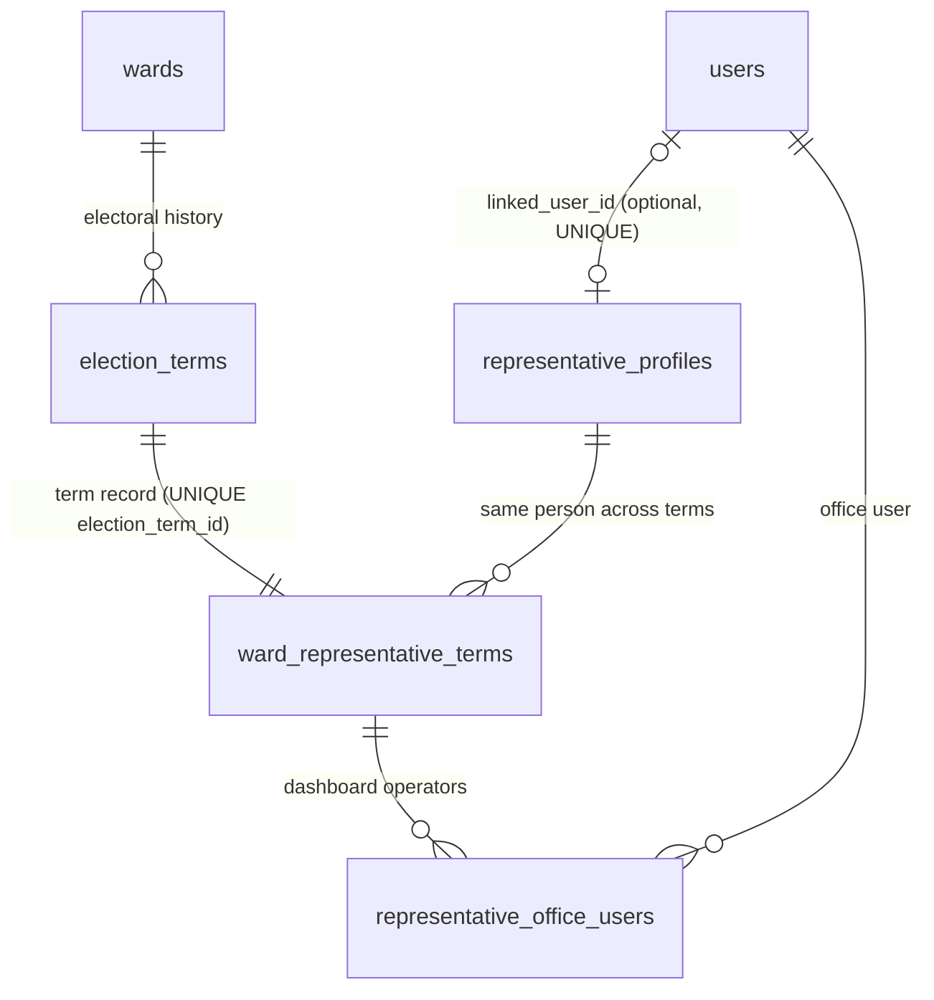
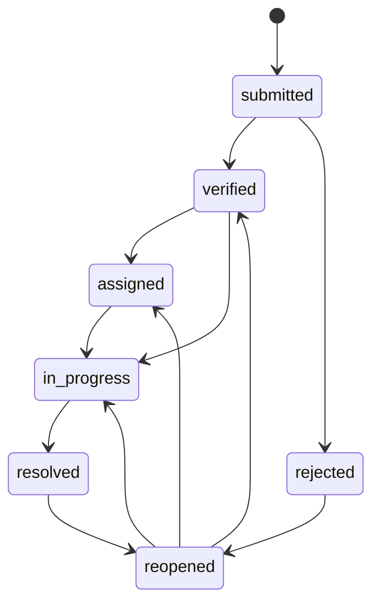

# WardSetu Backend — Database Architecture

> **Authoritative database reference for the WardSetu backend.**
> Source: _WardConnect — Backend Schema & API Specification_, **Version 4.0** (17 Sep 2026),
> read together with **v3.1** and **v3.0**, the earlier documents that v4.0 and v3.1 refer back to
> for unchanged sections (see §1.2). This document restates the specification for the database
> layer. It does **not** add, rename or redesign anything. Where the source is silent, ambiguous
> or internally inconsistent, that is flagged in
> [§17 Source gaps and open questions](#17-source-gaps-and-open-questions) rather than resolved
> here.

## Contents

1. [Document control](#1-document-control)
2. [Implementation status](#2-implementation-status)
3. [Governing principles](#3-governing-principles)
4. [Schema inventory](#4-schema-inventory)
5. [Location and administrative hierarchy](#5-location-and-administrative-hierarchy)
6. [Ward representative, election terms and office users](#6-ward-representative-election-terms-and-office-users)
7. [Election-day continuity and archival rules](#7-election-day-continuity-and-archival-rules)
8. [Carried-forward v1.0 tables](#8-carried-forward-v10-tables)
9. [New v2.0 tables (deep-research pass)](#9-new-v20-tables-deep-research-pass)
10. [Relationships](#10-relationships)
11. [Keys, unique and partial indexes, constraints](#11-keys-unique-and-partial-indexes-constraints)
12. [Issue state machine and transactional rules](#12-issue-state-machine-and-transactional-rules)
13. [Authentication, authorization, roles and permissions](#13-authentication-authorization-roles-and-permissions)
14. [Audit, consent, deletion, notification, device and feature-flag models](#14-audit-consent-deletion-notification-device-and-feature-flag-models)
15. [Cross-cutting data conventions](#15-cross-cutting-data-conventions)
16. [PostgreSQL / PostGIS recommendations and flagged future items](#16-postgresql--postgis-recommendations-and-flagged-future-items)
17. [Source gaps and open questions](#17-source-gaps-and-open-questions)
18. [v1.0 → v4.0 gap analysis (traceability)](#18-v10--v40-gap-analysis-traceability)
19. [API endpoints that read or write these tables](#19-api-endpoints-that-read-or-write-these-tables)

---

## 1. Document control

| Item               | Value                                                                                                                          |
| ------------------ | ------------------------------------------------------------------------------------------------------------------------------ |
| Source documents   | WardConnect — Backend Schema & API Specification **v4.0**, **v3.1** and **v3.0** (all dated 17 Sep 2026)                       |
| Current version    | **v4.0** (supersedes v3.1, same day)                                                                                           |
| Product name       | The source calls the platform **WardConnect**; this repository is the WardSetu backend.                                        |
| Identifier policy  | All table, column, enum-value, role, permission and endpoint names are copied verbatim from the source.                        |
| Scope of this file | Database structure, constraints, relationships and data rules. API detail is summarised only where it defines data behaviour.  |
| Change policy      | Changes to the data model must first be made in the specification, then reflected here, then implemented as Prisma migrations. |

### 1.1 Specification lineage

v3.1 and v4.0 are **delta documents**. They reprint only what changed and explicitly refer back to
the earlier version for everything else. This file merges them into one current view.

| Version | What it changed (source "What changed" summary)                                                                                                                                                                                                                                                                                 |
| ------- | ------------------------------------------------------------------------------------------------------------------------------------------------------------------------------------------------------------------------------------------------------------------------------------------------------------------------------- |
| v3.0    | Modelled the 5-year election cycle: `election_terms`, `representative_profiles`, `ward_representative_terms`, `representative_office_users`; roles `ward_representative` and `ward_rep_office`. Full table definitions for the location hierarchy, v1.0 tables and v2.0 deep-research tables.                                   |
| v3.1    | **Restored the missing `user_ward_roles` definition** (fully defined in v1.0, dropped by omission from v2.0/v3.0), added `election_term_id` to it, and resolved how the two representative roles authorise: **they get real `user_ward_roles` rows**. Corrected the carried-forward count to **23**. No other section changed.  |
| v4.0    | Added a **queryable roles and permissions catalog**: `roles`, `permissions`, `role_permissions` and optional `user_permission_overrides`, plus a permissions seed list and role mapping. The six role values, the role columns and v3.1's term-scoped authorization model are **unchanged**. No role gains or loses capability. |

### 1.2 Legend

| Marker                                           | Meaning                                                                                       |
| ------------------------------------------------ | --------------------------------------------------------------------------------------------- |
| **NEW (v2.0)** / **NEW (v3.0)** / **NEW (v4.0)** | Table introduced in that specification version.                                               |
| **MODIFIED (v2.0)** / **MODIFIED (v3.1)**        | Existing v1.0 table changed in that version.                                                  |
| **v1.0**                                         | Carried forward from v1.0 without structural change.                                          |
| **RETIRED**                                      | Table that existed in an earlier version and must not be implemented.                         |
| 🔶 **RECOMMENDED / FUTURE**                      | Flagged by the source as a recommendation or next step. **Not part of the current schema.**   |
| **OPTIONAL**                                     | Defined by the source but explicitly optional; may land later with no impact on other tables. |
| ⚠️ **SOURCE GAP**                                | The source is silent or ambiguous. Must be decided before implementation (see §17).           |
| _Type_ column "—"                                | The source does **not** state a data type. Do not infer one without a recorded decision.      |
| _Null_ column "NULL"                             | The source marks the column nullable. A blank means the source does not state nullability.    |

---

## 2. Implementation status

**Nothing in this document is implemented yet.**

| Area                           | Status                                                                                |
| ------------------------------ | ------------------------------------------------------------------------------------- |
| `prisma/schema.prisma`         | Contains no models.                                                                   |
| `prisma/migrations/`           | Contains only `migration_lock.toml` (PostgreSQL). No migrations.                      |
| Production `wardsetu` database | Existing schema unknown to this repository; not accessible from Claude Code.          |
| This document                  | Target design reference only. It is not a migration and must not be applied directly. |

Before any table here is created, the process in the `wardsetu-backend` skill applies: obtain an
operator-provided schema-only dump of the existing database, establish a non-destructive Prisma
baseline, then add version-controlled migrations for this design. Production migrations are
applied only by the authorised operator (`npm run prisma:migrate:deploy`).

---

## 3. Governing principles

These principles come from the source and constrain every table below.

1. **Normalised Pan-India hierarchy.** India's civic hierarchy is modelled as
   **State → District → City/ULB → Ward → Locality**, each level in its own table (§5).
2. **LGD alignment.** States, districts, ULBs and wards carry Local Government Directory (LGD)
   codes (`lgdirectory.gov.in`), the Ministry of Panchayati Raj / Registrar General of India
   standard mandated for e-governance systems by Cabinet Secretariat directive (04 Nov 2016), so
   the platform can reconcile against the official directory instead of keeping its own spellings.
3. **Seat reservation is seat metadata, not personal data.** `wards.reservation_category`
   records the legally mandated reservation of the ward **seat** under the 74th Constitutional
   Amendment (Articles 243P–243ZG). It is not a citizen attribute.
4. **No political or sensitive profiling.** _"No individual's caste, religion, or vote intent is
   stored anywhere in this schema."_ The PRD Non-Goal of never collecting citizen caste, religion
   or political-targeting data is preserved. `party_affiliation` exists only as the elected
   representative's **public record** (§6.3).
5. **Civic data belongs to the ward, permanently.** Elections change only representative-office
   access, never ward civic data (§7).
6. **History is kept, not overwritten.** Past terms and past representatives' profiles are
   retained; "archiving" means flipping `is_current` and revoking office-staff access.
7. **Open311 / GeoReport v2 as a naming reference.** Public issue fields are kept compatible in
   spirit with GeoReport v2 for a possible future read-only export; it is not adopted wholesale.
8. **UTC in the database.** Timestamps are stored in UTC and rendered in Asia/Kolkata (and the
   user's locale) in the UI.
9. **Honest forwarding.** _Never imply an issue was officially submitted to a municipal
   department when the platform only records an internal reference/forwarding action_
   (`issue_references`, §8.3).

---

## 4. Schema inventory

| Group                                 | Tables                                                                                                                                                                                                                                                                                                                                                         |  Count |
| ------------------------------------- | -------------------------------------------------------------------------------------------------------------------------------------------------------------------------------------------------------------------------------------------------------------------------------------------------------------------------------------------------------------- | -----: |
| Location hierarchy (§5)               | `states`, `districts`, `cities` (NEW v2.0); `wards`, `localities` (MODIFIED v2.0)                                                                                                                                                                                                                                                                              |      5 |
| Representation (§6)                   | `election_terms`, `representative_profiles`, `ward_representative_terms`, `representative_office_users` (NEW v3.0)                                                                                                                                                                                                                                             |      4 |
| Carried forward from v1.0 (§8)        | `users`, `user_ward_roles` (MODIFIED v3.1), `auth_sessions`, `otp_challenges`, `issue_categories`, `issues`, `issue_media`, `issue_events`, `departments`, `issue_references`, `updates`, `events`, `event_rsvps`, `schemes`, `library_items`, `opportunities`, `ideas`, `idea_votes`, `polls`, `poll_options`, `poll_votes`, `report_snapshots`, `audit_logs` |     23 |
| Deep-research pass (§9)               | `issue_ratings`, `issue_links`, `escalation_rules`, `issue_escalations`, `user_consents`, `data_deletion_requests`, `device_tokens`, `notification_preferences`, `feature_flags`, `ward_feature_flags`, `invites` (NEW v2.0)                                                                                                                                   |     11 |
| Roles and permissions catalog (§13.5) | `roles`, `permissions`, `role_permissions` (NEW v4.0)                                                                                                                                                                                                                                                                                                          |      3 |
| **Required tables**                   |                                                                                                                                                                                                                                                                                                                                                                | **46** |
| Optional (§13.5.4)                    | `user_permission_overrides` (NEW v4.0, **OPTIONAL**)                                                                                                                                                                                                                                                                                                           |      1 |
| **RETIRED — do not implement**        | `ward_representatives` (v2.0 flat table, replaced in v3.0 by `ward_representative_terms` + `representative_profiles`)                                                                                                                                                                                                                                          |      — |

> `wards` and `localities` existed in v1.0 and are counted under the hierarchy group because v2.0
> modified them. The source's "23 tables carried forward" count (corrected in v3.1 from v3.0's 22) excludes them.

---

## 5. Location and administrative hierarchy

**Hierarchy:** `states` 1→N `districts` 1→N `cities` 1→N `wards` 1→N `localities`.

v1.0 stored `state`, `district` and `ulb_name` as flat text on every `wards` row. That allowed
inconsistent spellings, had no ULB classification and no city-level standard code. v2.0
normalises the first three levels into their own tables with LGD codes and makes
`wards.city_id` the authoritative link.

Why a real `city_id` FK rather than a better string (source): search/filter ("show all wards in
Jaipur"), analytics roll-ups by ULB type, and de-duplication all require a single authoritative
row per city.

### 5.1 `states` — NEW (v2.0)

| Column           | Type | Null | Constraints / notes |
| ---------------- | ---- | ---- | ------------------- |
| `id`             | UUID |      | PK                  |
| `name`           | —    |      |                     |
| `iso_code`       | —    |      |                     |
| `lgd_state_code` | —    |      | UNIQUE              |
| `created_at`     | —    |      |                     |

### 5.2 `districts` — NEW (v2.0)

| Column              | Type | Null | Constraints / notes |
| ------------------- | ---- | ---- | ------------------- |
| `id`                | UUID |      | PK                  |
| `state_id`          | —    |      | FK → `states`       |
| `name`              | —    |      |                     |
| `lgd_district_code` | —    |      | UNIQUE              |
| `created_at`        | —    |      |                     |

### 5.3 `cities` (City / ULB) — NEW (v2.0)

| Column         | Type | Null | Constraints / notes                                                                                                           |
| -------------- | ---- | ---- | ----------------------------------------------------------------------------------------------------------------------------- |
| `id`           | UUID |      | PK                                                                                                                            |
| `district_id`  | —    |      | FK → `districts`                                                                                                              |
| `name`         | —    |      |                                                                                                                               |
| `ulb_type`     | —    |      | One of: `municipal_corporation`, `municipal_council`, `nagar_palika_parishad`, `nagar_panchayat`, `cantonment_board`, `other` |
| `lgd_ulb_code` | —    |      | UNIQUE                                                                                                                        |
| `population`   | —    |      |                                                                                                                               |
| `area_sq_km`   | —    | NULL |                                                                                                                               |
| `created_at`   | —    |      |                                                                                                                               |
| `updated_at`   | —    |      |                                                                                                                               |

### 5.4 `wards` — MODIFIED (v2.0)

| Column                          | Type | Null | Constraints / notes                                                                                                                    |
| ------------------------------- | ---- | ---- | -------------------------------------------------------------------------------------------------------------------------------------- |
| `id`                            | UUID |      | PK                                                                                                                                     |
| `city_id`                       | —    |      | FK → `cities`. **NEW, authoritative** link to the hierarchy.                                                                           |
| `ward_number`                   | —    |      |                                                                                                                                        |
| `name`                          | —    |      |                                                                                                                                        |
| `description`                   | —    |      |                                                                                                                                        |
| `status`                        | —    |      | Values not enumerated in source ⚠️                                                                                                     |
| `timezone`                      | —    |      |                                                                                                                                        |
| `branding_json`                 | —    |      |                                                                                                                                        |
| `reservation_category`          | —    | NULL | One of: `general`, `sc`, `st`, `obc`, `women`, `sc_women`, `st_women`, `obc_women`. Public, legally mandated **seat** metadata (§3.3). |
| `zone_or_borough`               | —    | NULL |                                                                                                                                        |
| `lgd_ward_code`                 | —    | NULL | UNIQUE                                                                                                                                 |
| `latitude`                      | —    | NULL |                                                                                                                                        |
| `longitude`                     | —    | NULL |                                                                                                                                        |
| `boundary_geojson`              | —    | NULL | Placeholder until PostGIS geometry (🔶 §16).                                                                                           |
| `created_at`                    | —    |      |                                                                                                                                        |
| `updated_at`                    | —    |      |                                                                                                                                        |
| `state`, `district`, `ulb_name` | —    |      | **Legacy, read-only.** Kept for backward compatibility. **Populated by trigger from `city_id` — never write to them directly.**        |

Rules from the source:

- `reservation_category` is nullable because not every state has finalised or published a
  reservation notification for every ward at all times: **store `NULL` rather than guessing.**
- `latitude`, `longitude` and `boundary_geojson` are optional for MVP. They exist so the product's
  ward-wise map view has real coordinates to read instead of an illustrative graphic.
- 🔶 **FUTURE:** move `reservation_category` to `election_terms` (§16.6). It is **not** moved yet.

### 5.5 `localities` — MODIFIED (v2.0)

| Column       | Type | Null | Constraints / notes |
| ------------ | ---- | ---- | ------------------- |
| `id`         | UUID |      | PK                  |
| `ward_id`    | —    |      | FK → `wards`        |
| `name`       | —    |      |                     |
| `landmark`   | —    |      |                     |
| `latitude`   | —    | NULL | NEW (v2.0)          |
| `longitude`  | —    | NULL | NEW (v2.0)          |
| `is_active`  | —    |      |                     |
| `created_at` | —    |      |                     |

---

## 6. Ward representative, election terms and office users

**RESTRUCTURED in v3.0.** v2.0 modelled the Parshad/Councillor as one flat
`ward_representatives` row (now **RETIRED**). v3.0 uses four cooperating tables so that:

- (a) a re-elected person's profile is **reused** rather than re-typed;
- (b) a defeated or retired representative's history is **preserved** rather than overwritten;
- (c) the people who actually operate the dashboard can be granted and revoked access
  **independently** of the elected person's own record.



### 6.1 `election_terms` — NEW (v3.0)

The 5-year electoral cycle, per ward.

| Column            | Type | Null | Constraints / notes                             |
| ----------------- | ---- | ---- | ----------------------------------------------- |
| `id`              | UUID |      | PK                                              |
| `ward_id`         | —    |      | FK → `wards`                                    |
| `term_number`     | INT  |      | 1st, 2nd… for that ward, independent of who won |
| `election_date`   | —    | NULL |                                                 |
| `term_start_date` | DATE |      |                                                 |
| `term_end_date`   | DATE |      |                                                 |
| `status`          | —    |      | One of: `upcoming`, `active`, `completed`       |
| `created_at`      | —    |      |                                                 |

Constraints:

- `UNIQUE(ward_id, term_number)`.
- **Partial UNIQUE index on `(ward_id) WHERE status = 'active'`**: a ward has at most one active
  term at a time.

### 6.2 `representative_profiles` — NEW (v3.0)

The enduring person, independent of any one term.

| Column                  | Type | Null | Constraints / notes                                                         |
| ----------------------- | ---- | ---- | --------------------------------------------------------------------------- |
| `id`                    | UUID |      | PK                                                                          |
| `full_name`             | —    |      |                                                                             |
| `photo_storage_key`     | —    | NULL |                                                                             |
| `default_bio`           | —    | NULL |                                                                             |
| `default_contact_phone` | —    | NULL |                                                                             |
| `default_contact_email` | —    | NULL |                                                                             |
| `linked_user_id`        | —    | NULL | FK → `users`, UNIQUE. **Set only if this person personally holds a login.** |
| `created_at`            | —    |      |                                                                             |
| `updated_at`            | —    |      |                                                                             |

Reuse rule: if the sitting Parshad wins again, the new term points at the **same** profile row
(photo, bio and contact carry forward with zero re-entry). If a different person wins, a new
profile is created **only if that person has never held office before**; otherwise their
existing profile from a previous, non-consecutive term is reused. The outgoing person's profile
is left untouched, never deleted.

### 6.3 `ward_representative_terms` — NEW (v3.0)

Who represented which ward, for which term. **Replaces v2.0 `ward_representatives` outright.** A
ward's current public representative is the row where `is_current = true`, joined to
`representative_profiles`.

| Column                      | Type    | Null | Constraints / notes                                                                                                |
| --------------------------- | ------- | ---- | ------------------------------------------------------------------------------------------------------------------ |
| `id`                        | UUID    |      | PK                                                                                                                 |
| `election_term_id`          | —       |      | FK → `election_terms`, **UNIQUE** (one representative record per term)                                             |
| `ward_id`                   | —       |      | FK → `wards`. **Denormalised; must match `election_terms.ward_id`.** ⚠️ Enforcement mechanism not specified (§17). |
| `representative_profile_id` | —       |      | FK → `representative_profiles`                                                                                     |
| `designation`               | —       |      | Default `'Parshad/Councillor'`, editable per state (e.g. `'Corporator'`)                                           |
| `party_affiliation`         | —       | NULL | Public record only (§3.4)                                                                                          |
| `is_independent`            | BOOLEAN |      |                                                                                                                    |
| `office_address`            | —       | NULL |                                                                                                                    |
| `term_bio_override`         | —       | NULL | Lets a returning representative post a term-specific message without losing `default_bio`                          |
| `is_current`                | BOOLEAN |      |                                                                                                                    |
| `created_at`                | —       |      |                                                                                                                    |
| `updated_at`                | —       |      |                                                                                                                    |

Constraint: **Partial UNIQUE index on `(ward_id) WHERE is_current = true`**, which enforces one
current representative per ward.

### 6.4 `representative_office_users` — NEW (v3.0)

The "ward users" (the Parshad's PA, secretary or office staff) who operate the dashboard on the
elected representative's behalf, without being the elected person and without `platform_admin`
or `ward_admin` rights.

| Column                        | Type    | Null | Constraints / notes                                |
| ----------------------------- | ------- | ---- | -------------------------------------------------- |
| `id`                          | UUID    |      | PK                                                 |
| `ward_representative_term_id` | —       |      | FK → `ward_representative_terms`                   |
| `user_id`                     | —       |      | FK → `users`                                       |
| `title`                       | —       | NULL | e.g. `'Personal Assistant'`, `'Office Secretary'`  |
| `added_by`                    | —       |      | FK (target not stated; ⚠️ presumably `users`, §17) |
| `is_active`                   | BOOLEAN |      |                                                    |
| `created_at`                  | —       |      |                                                    |
| `deactivated_at`              | —       | NULL |                                                    |

Constraints and rules:

- `UNIQUE(ward_representative_term_id, user_id)`.
- A ward can have **several** active office users at once (e.g. a secretary and a PA). Unlike the
  representative, this is deliberately **not** limited to one person.
- One user may assist more than one ward office (user 1→N `representative_office_users`).
- Office access is scoped to the **current active** term and is revoked when that term closes (§7).

### 6.5 Role values added for representation

`user_ward_roles.role` gains two values (v3.0):

| Role value            | Meaning                                                                              |
| --------------------- | ------------------------------------------------------------------------------------ |
| `ward_representative` | The elected person's own login, when they personally use one ("rare but supported"). |
| `ward_rep_office`     | Office/aide accounts operating the dashboard on the representative's behalf.         |

Both resolve to the **same effective permissions**. They are separate values purely so the audit
log can distinguish "the Parshad did this personally" from "their office did this on their
behalf".

**How they authorise (resolved in v3.1):** both roles get a **real `user_ward_roles` row** with
`election_term_id` set to the ward's current active term (§8.1, §13.3). Access is **not** derived
by joining through `representative_profiles` / `representative_office_users` on each request.

| Action                                                                                | Writes (same transaction)                                                                                                                                                                    |
| ------------------------------------------------------------------------------------- | -------------------------------------------------------------------------------------------------------------------------------------------------------------------------------------------- |
| Grant office access (`POST /wards/:id/representative/office-users`)                   | A `representative_office_users` row (title, `added_by`, `is_active`) **and** a `user_ward_roles` row `{user_id, ward_id, role: 'ward_rep_office', election_term_id: <current active term>}`. |
| Link the elected person's own login (`representative_profiles.linked_user_id` is set) | A `user_ward_roles` row `{user_id, ward_id, role: 'ward_representative', election_term_id: <current active term>}`.                                                                          |

Division of responsibility: `representative_office_users` = "who + what title, for the UI and
audit trail"; `user_ward_roles` = "what can this user actually do, checked by every guard".

---

## 7. Election-day continuity and archival rules

**Rule:** _ward-level civic data is never touched by an election; only representative-office
access is._

| Data                                                                               | On election day                                                                                                                                                                                                                                                                                                                                 |
| ---------------------------------------------------------------------------------- | ----------------------------------------------------------------------------------------------------------------------------------------------------------------------------------------------------------------------------------------------------------------------------------------------------------------------------------------------- |
| Issues, updates, events, schemes, library, opportunities, localities, departments  | **Unchanged, untouched, never migrated or duplicated.** They belong to the **ward** permanently. "What happened during term N" is answered by filtering `created_at` against that term's `election_terms.term_start_date` / `term_end_date`. That is a **query, not a data-migration job**.                                                     |
| Outgoing `ward_representative_terms` row                                           | `is_current` set to `false`. The row is **kept forever** as history, not archived to another table or deleted.                                                                                                                                                                                                                                  |
| Outgoing `representative_office_users` grants **and** their `user_ward_roles` rows | **Both actively revoked in one transaction:** `representative_office_users.is_active = false`, `deactivated_at = now()`, and **every `user_ward_roles` row with that `election_term_id` and `role IN ('ward_representative', 'ward_rep_office')` is deleted** (v3.1). An outgoing administration's staff must not retain live dashboard access. |
| `representative_profiles` row                                                      | Unchanged if the same person won. If a different person won, the outgoing profile is untouched; a new profile is created only for a first-time office holder, otherwise the existing profile is reused.                                                                                                                                         |
| `report_snapshots`                                                                 | Unaffected. The optional `election_term_id` FK (§8.6) makes "performance by term" a join, not a recomputation.                                                                                                                                                                                                                                  |

**Net effect:** "archiving" means flipping `is_current`, deleting the now-stale `user_ward_roles`
rows and deactivating `representative_office_users`, a same-day, low-risk, **single-transaction**
action. It **never** means bulk-copying or soft-deleting a ward's civic
history, which would make old citizen complaints or notices disappear.

### 7.1 New-term workflow — `POST /wards/:id/elections/new-term`

Run by a ward admin or platform admin. The body accepts **either** `representative_profile_id`
(re-elected or returning person; profile reused) **or** new person details (creates a new
`representative_profiles` row). **In one transaction:**

1. Close any current term: `election_terms.status → completed`,
   `ward_representative_terms.is_current → false`.
2. Revoke that term's `representative_office_users` (`is_active = false`, `deactivated_at`).
3. **Delete every `user_ward_roles` row with that term's `election_term_id` and
   `role IN ('ward_representative', 'ward_rep_office')`** (v3.1). Steps 1–3 are "a single atomic
   operation across three tables, not two separate flag-flips that authorization code has to trust
   are always kept in sync".
4. Create the new `election_terms` row and its `ward_representative_terms` row.

⚠️ Whether the new-term workflow also creates the incoming term's `ward_representative` row when
the representative has a `linked_user_id` is not stated (§17).

### 7.2 Early close — `POST /wards/:id/elections/close-term`

Explicit early close of the active term (e.g. resignation) **without** naming a successor. The
same revocation applies (office users deactivated, term-scoped `user_ward_roles` rows deleted, in
one transaction; v3.1 §2.5). The ward
is temporarily left **without a current representative**. The data model allows this: no row
with `is_current = true` and no `active` term.

### 7.3 Representative endpoints after v3.0

`GET`/`PUT /wards/:id/representative` and `GET /wards/:id/representative/history` keep their v2.0
URLs but read and write through `ward_representative_terms` + `representative_profiles`.
`/wards/:id/representative` always resolves to the `ward_representative_terms` row with
`is_current = true`.

🔶 **FUTURE:** a scheduled reminder ahead of `term_end_date` (§16.5).

---

## 8. Carried-forward v1.0 tables

The source lists these **23** tables as carried over from v1.0 (v3.1 corrected v3.0's count of 22:
`user_ward_roles` had been dropped from the list by omission). All are structurally unchanged
except `report_snapshots` (one nullable FK added in v3.0) and `user_ward_roles` (`election_term_id`
added in v3.1). Column types and nullability are not
stated for most columns (see legend).

### 8.1 Identity and authentication

#### `users` — v1.0

| Column       | Type | Null | Constraints / notes      |
| ------------ | ---- | ---- | ------------------------ |
| `id`         | UUID |      | PK                       |
| `mobile`     | —    |      | UNIQUE                   |
| `name`       | —    |      |                          |
| `email`      | —    |      |                          |
| `language`   | —    |      |                          |
| `status`     | —    |      | Values not enumerated ⚠️ |
| `created_at` | —    |      |                          |
| `updated_at` | —    |      |                          |

#### `user_ward_roles` — v1.0, MODIFIED (v3.1)

**The authorization table every role check goes through.** API middleware queries it on every
protected request (unchanged since v1.0). v1.0 definition: `id UUID PK; user_id FK; ward_id FK;
role; created_at; UNIQUE(user_id, ward_id, role)`. v3.1 restores that definition and adds
`election_term_id`.

| Column             | Type | Null | Constraints / notes                                                                                                                                                                                                   |
| ------------------ | ---- | ---- | --------------------------------------------------------------------------------------------------------------------------------------------------------------------------------------------------------------------- |
| `id`               | UUID |      | PK                                                                                                                                                                                                                    |
| `user_id`          | —    |      | FK → `users`                                                                                                                                                                                                          |
| `ward_id`          | —    | NULL | FK → `wards`. **`NULL` only for `platform_admin`**, whose access is cross-ward by definition.                                                                                                                         |
| `role`             | —    |      | One of: `citizen`, `ward_staff`, `ward_representative`, `ward_rep_office`, `ward_admin`, `platform_admin`. 🔶 Recommended FK → `roles.key` (v4.0, §13.5).                                                             |
| `election_term_id` | —    | NULL | FK → `election_terms`. **REQUIRED (non-null) when `role IN ('ward_representative', 'ward_rep_office')`; `NULL` for every other role** (those roles are permanent, not tied to an electoral cycle). **Added in v3.1.** |
| `created_at`       | —    |      |                                                                                                                                                                                                                       |
|                    |      |      | **UNIQUE(`user_id`, `ward_id`, `role`, `election_term_id`)** ⚠️ see §11.7 on `NULL` handling                                                                                                                          |

Row shape per role (v3.1 §6):

| Role                  | `ward_id` | `election_term_id`  | Row?                                                                                                       |
| --------------------- | --------- | ------------------- | ---------------------------------------------------------------------------------------------------------- |
| `citizen`             | —         | —                   | **Typically no row at all.** Access to their own data is via `issues.citizen_id`, not a granted ward role. |
| `ward_staff`          | set       | `NULL` (permanent)  | Yes                                                                                                        |
| `ward_admin`          | set       | `NULL` (permanent)  | Yes                                                                                                        |
| `ward_representative` | set       | current active term | Yes (required)                                                                                             |
| `ward_rep_office`     | set       | current active term | Yes (required)                                                                                             |
| `platform_admin`      | `NULL`    | `NULL`              | Yes                                                                                                        |

Lifecycle of term-scoped rows: created with office grants / login linking (§6.5); deleted when the
term closes (§7).

#### `auth_sessions` — v1.0

| Column               | Type | Null | Constraints / notes                     |
| -------------------- | ---- | ---- | --------------------------------------- |
| `id`                 | UUID |      | PK                                      |
| `user_id`            | —    |      | FK → `users`                            |
| `refresh_token_hash` | —    |      | Stored as a hash (per the column name). |
| `expires_at`         | —    |      |                                         |
| `revoked_at`         | —    |      |                                         |
| `created_at`         | —    |      |                                         |

#### `otp_challenges` — v1.0

| Column           | Type | Null | Constraints / notes     |
| ---------------- | ---- | ---- | ----------------------- |
| `id`             | UUID |      | PK                      |
| `mobile`         | —    |      | Not marked FK in source |
| `challenge_hash` | —    |      | Hash only               |
| `expires_at`     | —    |      |                         |
| `attempts`       | —    |      |                         |
| `verified_at`    | —    |      |                         |
| `created_at`     | —    |      |                         |

### 8.2 Issues

#### `issue_categories` — v1.0

| Column       | Type | Null | Constraints / notes                                                                                   |
| ------------ | ---- | ---- | ----------------------------------------------------------------------------------------------------- |
| `id`         | UUID |      | PK                                                                                                    |
| `ward_id`    | —    | NULL | Nullable; implies platform-wide categories when `NULL` (the source does not state this explicitly ⚠️) |
| `name`       | —    |      |                                                                                                       |
| `slug`       | —    |      |                                                                                                       |
| `icon_key`   | —    |      |                                                                                                       |
| `is_active`  | —    |      |                                                                                                       |
| `sort_order` | —    |      |                                                                                                       |

#### `issues` — v1.0

| Column        | Type | Null | Constraints / notes        |
| ------------- | ---- | ---- | -------------------------- |
| `id`          | UUID |      | PK                         |
| `ward_id`     | —    |      | FK → `wards`               |
| `citizen_id`  | —    |      | FK (→ `users`, by name)    |
| `category_id` | —    |      | FK → `issue_categories`    |
| `locality_id` | —    |      | Not marked FK in source ⚠️ |
| `title`       | —    |      |                            |
| `description` | —    |      |                            |
| `landmark`    | —    |      |                            |
| `latitude`    | —    |      |                            |
| `longitude`   | —    |      |                            |
| `priority`    | —    |      | Values not enumerated ⚠️   |
| `status`      | —    |      | State machine values (§12) |
| `assigned_to` | —    |      | Not marked FK in source ⚠️ |
| `created_at`  | —    |      |                            |
| `updated_at`  | —    |      |                            |
| `resolved_at` | —    |      |                            |
| `reopened_at` | —    |      |                            |

#### `issue_media` — v1.0

| Column        | Type | Null | Constraints / notes |
| ------------- | ---- | ---- | ------------------- |
| `id`          | UUID |      | PK                  |
| `issue_id`    | —    |      | FK → `issues`       |
| `media_type`  | —    |      |                     |
| `storage_key` | —    |      | Object-storage key  |
| `mime_type`   | —    |      |                     |
| `size_bytes`  | —    |      |                     |
| `caption`     | —    |      |                     |
| `created_at`  | —    |      |                     |

#### `issue_events` — v1.0

| Column          | Type | Null | Constraints / notes     |
| --------------- | ---- | ---- | ----------------------- |
| `id`            | UUID |      | PK                      |
| `issue_id`      | —    |      | FK → `issues`           |
| `actor_id`      | —    |      | FK (→ `users`, by name) |
| `event_type`    | —    |      |                         |
| `from_status`   | —    |      |                         |
| `to_status`     | —    |      |                         |
| `note`          | —    |      |                         |
| `metadata_json` | —    |      |                         |
| `created_at`    | —    |      |                         |

### 8.3 Departments and forwarding

#### `departments` — v1.0

| Column         | Type | Null | Constraints / notes                                                     |
| -------------- | ---- | ---- | ----------------------------------------------------------------------- |
| `id`           | UUID |      | PK                                                                      |
| `ward_id`      | —    |      | FK → `wards`                                                            |
| `name`         | —    |      |                                                                         |
| `contact_name` | —    |      |                                                                         |
| `phone`        | —    |      |                                                                         |
| `email`        | —    |      |                                                                         |
| `address`      | —    |      |                                                                         |
| `target_days`  | —    |      | Static target; complemented (not replaced) by `escalation_rules` (§9.3) |
| `is_active`    | —    |      |                                                                         |

#### `issue_references` — v1.0

Records an **internal** forwarding reference. It must never be presented as an official municipal
submission (§3.9).

| Column             | Type | Null | Constraints / notes |
| ------------------ | ---- | ---- | ------------------- |
| `id`               | UUID |      | PK                  |
| `issue_id`         | —    |      | FK → `issues`       |
| `department_id`    | —    |      | FK → `departments`  |
| `reference_number` | —    |      |                     |
| `forwarded_at`     | —    |      |                     |
| `note`             | —    |      |                     |
| `created_at`       | —    |      |                     |

### 8.4 Ward content

#### `updates` — v1.0

| Column       | Type | Null | Constraints / notes      |
| ------------ | ---- | ---- | ------------------------ |
| `id`         | UUID |      | PK                       |
| `ward_id`    | —    |      | FK → `wards`             |
| `author_id`  | —    |      | FK (→ `users`, by name)  |
| `title`      | —    |      | Single-locale (🔶 §16.2) |
| `body`       | —    |      | Single-locale (🔶 §16.2) |
| `category`   | —    |      |                          |
| `status`     | —    |      |                          |
| `publish_at` | —    |      |                          |
| `pinned`     | —    |      |                          |
| `created_at` | —    |      |                          |
| `updated_at` | —    |      |                          |

#### `events` — v1.0

| Column        | Type | Null | Constraints / notes     |
| ------------- | ---- | ---- | ----------------------- |
| `id`          | UUID |      | PK                      |
| `ward_id`     | —    |      | FK → `wards`            |
| `created_by`  | —    |      | FK (→ `users`, by name) |
| `title`       | —    |      |                         |
| `description` | —    |      |                         |
| `venue`       | —    |      |                         |
| `starts_at`   | —    |      |                         |
| `ends_at`     | —    |      |                         |
| `capacity`    | —    |      |                         |
| `status`      | —    |      |                         |
| `created_at`  | —    |      |                         |

#### `event_rsvps` — v1.0

| Column       | Type | Null | Constraints / notes               |
| ------------ | ---- | ---- | --------------------------------- |
| `id`         | UUID |      | PK                                |
| `event_id`   | —    |      | FK → `events`                     |
| `user_id`    | —    |      | FK → `users`                      |
| `status`     | —    |      |                                   |
| `created_at` | —    |      |                                   |
|              |      |      | **UNIQUE(`event_id`, `user_id`)** |

#### `schemes` — v1.0

| Column         | Type | Null | Constraints / notes |
| -------------- | ---- | ---- | ------------------- |
| `id`           | UUID |      | PK                  |
| `ward_id`      | —    |      | FK → `wards`        |
| `title`        | —    |      |                     |
| `summary`      | —    |      |                     |
| `eligibility`  | —    |      |                     |
| `instructions` | —    |      |                     |
| `official_url` | —    |      |                     |
| `status`       | —    |      |                     |
| `created_at`   | —    |      |                     |
| `updated_at`   | —    |      |                     |

#### `library_items` — v1.0

| Column        | Type | Null | Constraints / notes |
| ------------- | ---- | ---- | ------------------- |
| `id`          | UUID |      | PK                  |
| `ward_id`     | —    |      | FK → `wards`        |
| `title`       | —    |      |                     |
| `type`        | —    |      |                     |
| `description` | —    |      |                     |
| `url`         | —    |      |                     |
| `storage_key` | —    |      |                     |
| `language`    | —    |      |                     |
| `status`      | —    |      |                     |
| `created_at`  | —    |      |                     |

#### `opportunities` — v1.0

| Column              | Type | Null | Constraints / notes |
| ------------------- | ---- | ---- | ------------------- |
| `id`                | UUID |      | PK                  |
| `ward_id`           | —    |      | FK → `wards`        |
| `audience`          | —    |      |                     |
| `title`             | —    |      |                     |
| `organization_name` | —    |      |                     |
| `description`       | —    |      |                     |
| `location`          | —    |      |                     |
| `apply_url`         | —    |      |                     |
| `expires_at`        | —    |      |                     |
| `status`            | —    |      |                     |
| `created_at`        | —    |      |                     |

### 8.5 Participation

#### `ideas` — v1.0

| Column          | Type | Null | Constraints / notes        |
| --------------- | ---- | ---- | -------------------------- |
| `id`            | UUID |      | PK                         |
| `ward_id`       | —    |      | FK → `wards`               |
| `user_id`       | —    |      | FK → `users`               |
| `title`         | —    |      |                            |
| `description`   | —    |      |                            |
| `locality_id`   | —    |      | Not marked FK in source ⚠️ |
| `status`        | —    |      |                            |
| `upvotes_count` | —    |      | Denormalised counter       |
| `created_at`    | —    |      |                            |
| `updated_at`    | —    |      |                            |

#### `idea_votes` — v1.0

| Column       | Type | Null | Constraints / notes              |
| ------------ | ---- | ---- | -------------------------------- |
| `id`         | UUID |      | PK                               |
| `idea_id`    | —    |      | FK → `ideas`                     |
| `user_id`    | —    |      | FK → `users`                     |
| `created_at` | —    |      |                                  |
|              |      |      | **UNIQUE(`idea_id`, `user_id`)** |

#### `polls` — v1.0

| Column       | Type | Null | Constraints / notes     |
| ------------ | ---- | ---- | ----------------------- |
| `id`         | UUID |      | PK                      |
| `ward_id`    | —    |      | FK → `wards`            |
| `created_by` | —    |      | FK (→ `users`, by name) |
| `question`   | —    |      |                         |
| `status`     | —    |      |                         |
| `starts_at`  | —    |      |                         |
| `ends_at`    | —    |      |                         |
| `created_at` | —    |      |                         |

#### `poll_options` — v1.0

| Column       | Type | Null | Constraints / notes |
| ------------ | ---- | ---- | ------------------- |
| `id`         | UUID |      | PK                  |
| `poll_id`    | —    |      | FK → `polls`        |
| `label`      | —    |      |                     |
| `sort_order` | —    |      |                     |

#### `poll_votes` — v1.0

| Column       | Type | Null | Constraints / notes                                          |
| ------------ | ---- | ---- | ------------------------------------------------------------ |
| `id`         | UUID |      | PK                                                           |
| `poll_id`    | —    |      | FK → `polls`                                                 |
| `option_id`  | —    |      | FK → `poll_options`                                          |
| `user_id`    | —    |      | FK → `users`                                                 |
| `created_at` | —    |      |                                                              |
|              |      |      | **UNIQUE(`poll_id`, `user_id`)**: one vote per user per poll |

### 8.6 Reporting and audit

#### `report_snapshots` — v1.0 (one column added in v3.0)

| Column             | Type | Null | Constraints / notes                                                                                      |
| ------------------ | ---- | ---- | -------------------------------------------------------------------------------------------------------- |
| `id`               | UUID |      | PK                                                                                                       |
| `ward_id`          | —    |      | FK → `wards`                                                                                             |
| `period_start`     | —    |      |                                                                                                          |
| `period_end`       | —    |      |                                                                                                          |
| `metrics_json`     | —    |      |                                                                                                          |
| `generated_at`     | —    |      |                                                                                                          |
| `storage_key`      | —    |      |                                                                                                          |
| `election_term_id` | —    | NULL | FK → `election_terms`. **Added v3.0, optional.** Attributes a snapshot to a term for by-term comparison. |

#### `audit_logs` — v1.0

| Column        | Type | Null | Constraints / notes                    |
| ------------- | ---- | ---- | -------------------------------------- |
| `id`          | UUID |      | PK                                     |
| `ward_id`     | —    |      | Not marked FK in source                |
| `actor_id`    | —    |      | Not marked FK in source                |
| `action`      | —    |      |                                        |
| `entity_type` | —    |      |                                        |
| `entity_id`   | —    |      |                                        |
| `before_json` | —    |      |                                        |
| `after_json`  | —    |      |                                        |
| `ip_hash`     | —    |      | Stored as a hash (per the column name) |
| `user_agent`  | —    |      |                                        |
| `created_at`  | —    |      |                                        |

---

## 9. New v2.0 tables (deep-research pass)

Each table closes a gap found by comparing v1.0 against the PRD/TRD's stated requirements
(consent, retention, escalation, moderation) and common civic-platform practice.

### 9.1 `issue_ratings` — NEW (v2.0)

| Column       | Type     | Null | Constraints / notes                              |
| ------------ | -------- | ---- | ------------------------------------------------ |
| `id`         | UUID     |      | PK                                               |
| `issue_id`   | —        |      | FK → `issues`, **UNIQUE** (one rating per issue) |
| `user_id`    | —        |      | FK → `users`                                     |
| `rating`     | SMALLINT |      | **CHECK 1–5**                                    |
| `comment`    | —        | NULL |                                                  |
| `created_at` | —        |      |                                                  |

Rule: a rating can only be submitted **once an issue reaches `resolved`** (§12). Closes the gap of
no satisfaction signal after resolution (needed for the Scorecard module's quality metrics).

### 9.2 `issue_links` — NEW (v2.0)

| Column            | Type | Null | Constraints / notes                       |
| ----------------- | ---- | ---- | ----------------------------------------- |
| `id`              | UUID |      | PK                                        |
| `issue_id`        | —    |      | FK → `issues`                             |
| `linked_issue_id` | —    |      | FK → `issues` (self-reference)            |
| `link_type`       | —    |      | One of: `duplicate`, `related`            |
| `created_by`      | —    |      | FK (→ `users`, by name)                   |
| `created_at`      | —    |      |                                           |
|                   |      |      | **UNIQUE(`issue_id`, `linked_issue_id`)** |

Closes PRD §6's "duplicate/related issue linking".

### 9.3 `escalation_rules` — NEW (v2.0)

| Column             | Type | Null | Constraints / notes                                       |
| ------------------ | ---- | ---- | --------------------------------------------------------- |
| `id`               | UUID |      | PK                                                        |
| `ward_id`          | —    | NULL | **`NULL` = platform default rule**                        |
| `category_id`      | —    | NULL |                                                           |
| `ageing_days`      | INT  |      |                                                           |
| `escalate_to_role` | —    |      | Role value. 🔶 Recommended FK → `roles.key` (v4.0, §13.5) |
| `is_active`        | —    |      |                                                           |
| `created_at`       | —    |      |                                                           |

Rule lookup is ward-scoped and **falls back to the platform default** (`GET /escalation-rules`).
Closes PRD §6 / TRD §1 "ageing buckets" and "configurable escalation targets".

### 9.4 `issue_escalations` — NEW (v2.0)

| Column                 | Type | Null | Constraints / notes     |
| ---------------------- | ---- | ---- | ----------------------- |
| `id`                   | UUID |      | PK                      |
| `issue_id`             | —    |      | FK → `issues`           |
| `rule_id`              | —    |      | FK → `escalation_rules` |
| `escalated_at`         | —    |      |                         |
| `escalated_to_user_id` | —    |      | FK (→ `users`, by name) |
| `resolved_at`          | —    | NULL |                         |

An auditable record of every time an ageing issue triggered an escalation.

### 9.5 `user_consents` — NEW (v2.0)

See §14.2.

| Column         | Type | Null | Constraints / notes                                  |
| -------------- | ---- | ---- | ---------------------------------------------------- |
| `id`           | UUID |      | PK                                                   |
| `user_id`      | —    |      | FK → `users`                                         |
| `consent_type` | —    |      | One of: `privacy_notice`, `terms`, `location_access` |
| `version`      | —    |      |                                                      |
| `granted_at`   | —    |      |                                                      |
| `revoked_at`   | —    | NULL |                                                      |

### 9.6 `data_deletion_requests` — NEW (v2.0)

See §14.3.

| Column         | Type | Null | Constraints / notes                        |
| -------------- | ---- | ---- | ------------------------------------------ |
| `id`           | UUID |      | PK                                         |
| `user_id`      | —    |      | FK → `users`                               |
| `status`       | —    |      | One of: `pending`, `completed`, `rejected` |
| `requested_at` | —    |      |                                            |
| `processed_at` | —    | NULL |                                            |
| `processed_by` | —    | NULL | FK (→ `users`, by name)                    |

### 9.7 `device_tokens` — NEW (v2.0)

See §14.5.

| Column         | Type | Null | Constraints / notes             |
| -------------- | ---- | ---- | ------------------------------- |
| `id`           | UUID |      | PK                              |
| `user_id`      | —    |      | FK → `users`                    |
| `platform`     | —    |      | One of: `android`, `ios`, `web` |
| `push_token`   | —    |      |                                 |
| `is_active`    | —    |      |                                 |
| `last_seen_at` | —    |      |                                 |
| `created_at`   | —    |      |                                 |

### 9.8 `notification_preferences` — NEW (v2.0)

See §14.4.

| Column             | Type | Null | Constraints / notes                         |
| ------------------ | ---- | ---- | ------------------------------------------- |
| `id`               | UUID |      | PK                                          |
| `user_id`          | —    |      | FK → `users`, **UNIQUE** (one row per user) |
| `categories_json`  | —    |      |                                             |
| `quiet_hours_json` | —    | NULL |                                             |
| `updated_at`       | —    |      |                                             |

### 9.9 `feature_flags` — NEW (v2.0)

See §14.6.

| Column               | Type | Null | Constraints / notes |
| -------------------- | ---- | ---- | ------------------- |
| `id`                 | UUID |      | PK                  |
| `key`                | —    |      | **UNIQUE**          |
| `description`        | —    |      |                     |
| `is_enabled_default` | —    |      |                     |
| `created_at`         | —    |      |                     |

### 9.10 `ward_feature_flags` — NEW (v2.0)

| Column       | Type | Null | Constraints / notes                                                     |
| ------------ | ---- | ---- | ----------------------------------------------------------------------- |
| `ward_id`    | —    |      | FK → `wards`                                                            |
| `flag_id`    | —    |      | FK → `feature_flags`                                                    |
| `is_enabled` | —    |      |                                                                         |
|              |      |      | **PRIMARY KEY(`ward_id`, `flag_id`)**: composite key, no surrogate `id` |

### 9.11 `invites` — NEW (v2.0)

See §13.4.

| Column        | Type | Null | Constraints / notes                                       |
| ------------- | ---- | ---- | --------------------------------------------------------- |
| `id`          | UUID |      | PK                                                        |
| `ward_id`     | —    |      | FK → `wards`                                              |
| `mobile`      | —    |      |                                                           |
| `role`        | —    |      | Role value. 🔶 Recommended FK → `roles.key` (v4.0, §13.5) |
| `invited_by`  | —    |      | FK (→ `users`, by name)                                   |
| `token_hash`  | —    |      | Hash only                                                 |
| `status`      | —    |      | One of: `pending`, `accepted`, `expired`, `revoked`       |
| `expires_at`  | —    |      |                                                           |
| `accepted_at` | —    | NULL |                                                           |
| `created_at`  | —    |      |                                                           |

---

## 10. Relationships

As stated in source §5 (v3.0, v3.1, v4.0):

- `user_ward_roles` N→1 `users`, N→1 `wards` (nullable), N→1 `election_terms` (nullable): "the
  single table every authorization check queries, for every role" (v3.1).
- `roles` 1→N `role_permissions` N→1 `permissions`: the standard many-to-many join for RBAC
  (v4.0).
- `user_ward_roles.role`, `escalation_rules.escalate_to_role`, `invites.role` → `roles.key`: 🔶
  recommended new FK on all three, additive and non-breaking (v4.0).
- `user_permission_overrides` N→1 `users`, N→1 `wards` (nullable), N→1 `permissions` (v4.0,
  optional).
- `states` 1→N `districts` 1→N `cities` 1→N `wards`: the normalised replacement for the old flat
  `state`/`district`/`ulb_name` strings.
- `wards` 1→N `election_terms` (full electoral history); `election_terms` 1→1
  `ward_representative_terms`; `ward_representative_terms` N→1 `representative_profiles` (many
  terms can point at the same person over time).
- `ward_representative_terms` 1→N `representative_office_users`: the current term's dashboard
  operators.
- `wards` 1→N `localities`, `issues`, `departments`, `updates`, `events`, `schemes`,
  `library_items`, `opportunities`, `ideas`, `polls`, `escalation_rules` (unchanged from v1.0).
- `issues` 1→1 `issue_ratings`; `issues` 1→N `issue_links` (self-referencing),
  `issue_escalations`, `issue_media`, `issue_events`.
- `users` 1→N `device_tokens`, `user_consents`, `data_deletion_requests`; `users` 1→1
  `notification_preferences`; `users` 1→N `representative_office_users` (one person could
  conceivably assist more than one ward office).

Additional FKs stated in the table definitions: `report_snapshots.election_term_id` →
`election_terms`; `representative_profiles.linked_user_id` → `users` (optional, 1→0..1);
`issue_references` → `issues`, `departments`; `issue_escalations.rule_id` → `escalation_rules`;
`ward_feature_flags` → `wards`, `feature_flags`; `poll_votes.option_id` → `poll_options`.

```mermaid
erDiagram
    states ||--o{ districts : has
    districts ||--o{ cities : has
    cities ||--o{ wards : has
    wards ||--o{ localities : has
    wards ||--o{ election_terms : has
    election_terms ||--|| ward_representative_terms : has
    representative_profiles ||--o{ ward_representative_terms : serves
    ward_representative_terms ||--o{ representative_office_users : grants
    wards ||--o{ issues : has
    wards ||--o{ departments : has
    wards ||--o{ updates : has
    wards ||--o{ events : has
    wards ||--o{ schemes : has
    wards ||--o{ library_items : has
    wards ||--o{ opportunities : has
    wards ||--o{ ideas : has
    wards ||--o{ polls : has
    wards ||--o{ escalation_rules : "has (NULL ward = platform default)"
    wards ||--o{ ward_feature_flags : overrides
    feature_flags ||--o{ ward_feature_flags : "per-ward override"
    issue_categories ||--o{ issues : categorises
    issues ||--o| issue_ratings : "rated once"
    issues ||--o{ issue_links : links
    issues ||--o{ issue_escalations : escalates
    escalation_rules ||--o{ issue_escalations : triggers
    issues ||--o{ issue_media : has
    issues ||--o{ issue_events : history
    issues ||--o{ issue_references : forwarded
    departments ||--o{ issue_references : receives
    events ||--o{ event_rsvps : has
    ideas ||--o{ idea_votes : has
    polls ||--o{ poll_options : has
    polls ||--o{ poll_votes : has
    poll_options ||--o{ poll_votes : chosen
    election_terms |o--o{ report_snapshots : "optional attribution"
    wards ||--o{ report_snapshots : has
    users ||--o{ auth_sessions : has
    users ||--o{ device_tokens : has
    users ||--o{ user_consents : grants
    users ||--o{ data_deletion_requests : requests
    users ||--o| notification_preferences : has
    users ||--o{ representative_office_users : "acts as"
    users |o--o| representative_profiles : "linked login"
    wards ||--o{ invites : issues
    users ||--o{ user_ward_roles : "is granted"
    wards |o--o{ user_ward_roles : "scopes (NULL = platform_admin)"
    election_terms |o--o{ user_ward_roles : "term-scoped roles"
    roles ||--o{ user_ward_roles : "role (recommended FK)"
    roles ||--o{ role_permissions : grants
    permissions ||--o{ role_permissions : "granted by"
    users ||--o{ user_permission_overrides : "has (optional)"
    permissions ||--o{ user_permission_overrides : overrides
    wards |o--o{ user_permission_overrides : "scopes (NULL = global)"
```



---

## 11. Keys, unique and partial indexes, constraints

### 11.1 Primary keys

Every table has `id UUID PK` **except**:

| Table                | Primary key                                                                                  |
| -------------------- | -------------------------------------------------------------------------------------------- |
| `ward_feature_flags` | Composite `PRIMARY KEY(ward_id, flag_id)`                                                    |
| `roles`              | **Natural key** `key VARCHAR PK` (the same strings already stored in the role columns, v4.0) |
| `role_permissions`   | Composite `PRIMARY KEY(role_key, permission_id)`                                             |

### 11.2 Unique constraints

| Table                         | Unique constraint                                       |
| ----------------------------- | ------------------------------------------------------- |
| `states`                      | `lgd_state_code`                                        |
| `districts`                   | `lgd_district_code`                                     |
| `cities`                      | `lgd_ulb_code`                                          |
| `wards`                       | `lgd_ward_code` (nullable)                              |
| `users`                       | `mobile`                                                |
| `representative_profiles`     | `linked_user_id` (nullable)                             |
| `election_terms`              | `(ward_id, term_number)`                                |
| `ward_representative_terms`   | `election_term_id`                                      |
| `representative_office_users` | `(ward_representative_term_id, user_id)`                |
| `event_rsvps`                 | `(event_id, user_id)`                                   |
| `idea_votes`                  | `(idea_id, user_id)`                                    |
| `poll_votes`                  | `(poll_id, user_id)`                                    |
| `issue_ratings`               | `issue_id`                                              |
| `issue_links`                 | `(issue_id, linked_issue_id)`                           |
| `notification_preferences`    | `user_id`                                               |
| `feature_flags`               | `key`                                                   |
| `user_ward_roles`             | `(user_id, ward_id, role, election_term_id)` (⚠️ §11.7) |
| `permissions`                 | `key`                                                   |

### 11.3 Partial unique indexes (business invariants)

| Index                                                        | Invariant                                        |
| ------------------------------------------------------------ | ------------------------------------------------ |
| `election_terms(ward_id) WHERE status = 'active'`            | At most **one active term** per ward.            |
| `ward_representative_terms(ward_id) WHERE is_current = true` | At most **one current representative** per ward. |

### 11.4 Check constraints

| Table             | Constraint                                                                                                                                                                                 |
| ----------------- | ------------------------------------------------------------------------------------------------------------------------------------------------------------------------------------------ |
| `issue_ratings`   | `rating` SMALLINT `CHECK` 1–5                                                                                                                                                              |
| `user_ward_roles` | `election_term_id` **required** when `role IN ('ward_representative', 'ward_rep_office')`, `NULL` otherwise (rule stated in v3.1; enforcing it as a `CHECK` is the natural implementation) |
| `user_ward_roles` | `ward_id` `NULL` **only** for `platform_admin` (rule stated in v3.1)                                                                                                                       |

### 11.5 Indexes (source §5 "New indexes", v3.0 + v3.1 + v4.0)

| Index                                                                  | Purpose                                                         |
| ---------------------------------------------------------------------- | --------------------------------------------------------------- |
| `wards(city_id)`                                                       | Hierarchy traversal / "wards in a city"                         |
| `wards(reservation_category)`                                          | Filtering by seat reservation                                   |
| `wards(lgd_ward_code)`                                                 | LGD reconciliation                                              |
| `election_terms(ward_id, term_number)` UNIQUE                          | Term ordering per ward                                          |
| `election_terms(ward_id) WHERE status = 'active'` partial UNIQUE       | One active term                                                 |
| `ward_representative_terms(ward_id) WHERE is_current` partial UNIQUE   | One current representative                                      |
| `ward_representative_terms(representative_profile_id)`                 | "All terms this person has served" (re-election reuse flow)     |
| `representative_office_users(ward_representative_term_id, is_active)`  | Active office users for a term                                  |
| `issue_links(issue_id)`, `issue_links(linked_issue_id)`                | Link lookup in both directions                                  |
| `issue_escalations(issue_id, escalated_at DESC)`                       | Latest escalations per issue                                    |
| `device_tokens(user_id, is_active)`                                    | Active devices per user                                         |
| `user_ward_roles(user_id, ward_id)`                                    | **The hot path every request authorization check hits** (v3.1)  |
| `user_ward_roles(election_term_id) WHERE election_term_id IS NOT NULL` | Partial index for the term-close revocation `DELETE` (v3.1)     |
| `role_permissions(permission_id)`                                      | "Which roles can do X" (admin permission-matrix UI) (v4.0)      |
| `user_permission_overrides(user_id, ward_id)`                          | Override lookup after `role_permissions` (v4.0, optional table) |

**All v1.0 indexes are retained unchanged**, e.g. `issues(ward_id, status, created_at DESC)`. The
source cites this one as an example and does not reproduce the full v1.0 index list ⚠️ (§17).

### 11.6 Enumerated value sets

The source lists these allowed values. It does not say whether to implement them as PostgreSQL
enums or `CHECK` constraints (implementation decision).

| Column                                                                                   | Values                                                                                                                                             |
| ---------------------------------------------------------------------------------------- | -------------------------------------------------------------------------------------------------------------------------------------------------- |
| `cities.ulb_type`                                                                        | `municipal_corporation`, `municipal_council`, `nagar_palika_parishad`, `nagar_panchayat`, `cantonment_board`, `other`                              |
| `wards.reservation_category`                                                             | `general`, `sc`, `st`, `obc`, `women`, `sc_women`, `st_women`, `obc_women` (nullable)                                                              |
| `election_terms.status`                                                                  | `upcoming`, `active`, `completed`                                                                                                                  |
| `issues.status`                                                                          | `submitted`, `verified`, `assigned`, `in_progress`, `resolved`, `reopened`, `rejected` (§12)                                                       |
| `issue_links.link_type`                                                                  | `duplicate`, `related`                                                                                                                             |
| `user_consents.consent_type`                                                             | `privacy_notice`, `terms`, `location_access`                                                                                                       |
| `data_deletion_requests.status`                                                          | `pending`, `completed`, `rejected`                                                                                                                 |
| `device_tokens.platform`                                                                 | `android`, `ios`, `web`                                                                                                                            |
| `invites.status`                                                                         | `pending`, `accepted`, `expired`, `revoked`                                                                                                        |
| `user_ward_roles.role`, `escalation_rules.escalate_to_role`, `invites.role`, `roles.key` | `citizen`, `ward_staff`, `ward_representative`, `ward_rep_office`, `ward_admin`, `platform_admin` (v4.0: `roles` is seeded with exactly these six) |
| `user_permission_overrides.effect`                                                       | `grant`, `deny`                                                                                                                                    |

### 11.7 Other integrity rules

- **Denormalised `ward_representative_terms.ward_id` must equal
  `election_terms.ward_id`** for its `election_term_id`. ⚠️ Mechanism not specified (§17).
- **Legacy `wards.state` / `district` / `ulb_name`** are trigger-populated from `city_id` and
  never written directly.
- **Issue status transitions** are restricted to the state machine (§12).
- **`issue_ratings`** only after `resolved`.
- **`NULL` in `user_ward_roles` uniqueness** ⚠️: PostgreSQL treats `NULL`s as distinct in a plain
  `UNIQUE` constraint, so `UNIQUE(user_id, ward_id, role, election_term_id)` alone does **not**
  prevent duplicate permanent rows (`election_term_id IS NULL`) or duplicate `platform_admin` rows
  (`ward_id IS NULL`). The intended uniqueness needs `UNIQUE NULLS NOT DISTINCT` (PostgreSQL 15+)
  or equivalent partial unique indexes. This is an implementation detail of the stated
  constraint, to be confirmed (§17).
- **Role columns → `roles.key`** 🔶: the recommended FKs only add validation. Any row satisfying
  the current six-value set already satisfies them.

---

## 12. Issue state machine and transactional rules

**Unchanged from v1.0.**

| Current       | Allowed next                          |
| ------------- | ------------------------------------- |
| `submitted`   | `verified`, `rejected`                |
| `verified`    | `assigned`, `in_progress`             |
| `assigned`    | `in_progress`                         |
| `in_progress` | `resolved`                            |
| `resolved`    | `reopened`                            |
| `reopened`    | `verified`, `assigned`, `in_progress` |
| `rejected`    | `reopened`                            |



Only the listed "Allowed next" transitions are permitted. The state machine contains no `closed` state.

### 12.1 Transactional rules

1. **A status change, its `issue_events` row and its `audit_logs` row commit in one transaction**
   (unchanged). None may be persisted without the others.
2. `issue_ratings` and `issue_escalations` are **side records, not states**. They do not take
   part in transitions.
3. A rating can only be submitted once the issue has reached `resolved`.
4. The **new-term election workflow** is a single transaction (§7.1).
5. **Granting office access** writes `representative_office_users` **and** the matching
   `user_ward_roles` (`ward_rep_office`, current term) row in the same transaction (v3.1, §6.5).
6. **Closing a term** (new-term or close-term) sets `ward_representative_terms.is_current = false`,
   deactivates `representative_office_users` and deletes the term's `ward_representative` /
   `ward_rep_office` rows from `user_ward_roles`, as **one atomic operation across three tables**
   (v3.1, §7).
7. **Changing a role's permission set** (`PATCH /roles/:key/permissions`) is platform-admin only
   and **heavily audited** in `audit_logs` (v4.0, §13.5).

### 12.2 Issue endpoints and the transitions they drive

The source lists these endpoints without mapping them to transitions. The mapping below is
implied by their names and is **not** stated verbatim in the source.

| Endpoint                     | Implied effect                                             |
| ---------------------------- | ---------------------------------------------------------- |
| `POST /issues`               | Creates an issue (initial state `submitted`)               |
| `POST /issues/:id/verify`    | → `verified`                                               |
| `POST /issues/:id/assign`    | → `assigned`                                               |
| `POST /issues/:id/progress`  | Progress note / → `in_progress`                            |
| `POST /issues/:id/resolve`   | → `resolved`                                               |
| `POST /issues/:id/reopen`    | → `reopened`                                               |
| `POST /issues/:id/forward`   | Records an `issue_references` row (no state change stated) |
| `POST /issues/:id/follow-up` | Citizen follow-up                                          |
| `POST /issues/:id/rate`      | Creates `issue_ratings` (only when `resolved`)             |
| `POST /issues/:id/link`      | Creates `issue_links`                                      |

---

## 13. Authentication, authorization, roles and permissions

### 13.1 Authentication

- **OTP login by mobile number:** `otp_challenges` stores `challenge_hash`, `expires_at` and
  `attempts`; `POST /auth/otp/request` and `POST /auth/otp/verify`.
- **Sessions:** `auth_sessions` stores `refresh_token_hash` (a hash, per the column name),
  `expires_at` and `revoked_at`; `POST /auth/refresh` rotates the refresh token and
  `POST /auth/logout` revokes the session.
- **Identity:** `users.mobile` is UNIQUE.

### 13.2 Authorization flow (v4.0 §6)

Authorization is enforced in **API middleware plus service/repository queries** (unchanged v1.0
principle). **Client-side filtering is never a security control.** The middleware's job:

```text
1. Look up the caller's role(s) in user_ward_roles
   (respecting election_term_id currency for term-scoped roles, v3.1 §2.5)
2. Resolve effective permissions via role_permissions
3. Apply any user_permission_overrides (optional table)
4. Allow / deny
```

Design intent (v3.1): **one uniform query shape for every role**: "does a live `user_ward_roles`
row exist for this user, this ward, and (if the role requires it) the ward's current active term".
No special-case join path through `representative_profiles` / `representative_office_users`.

### 13.3 `user_ward_roles`

Defined in §8.1 (v1.0, MODIFIED v3.1). It remains the source of **which role a user holds where**.
v4.0 does not change its columns or values.

### 13.4 Roles and effective access

The access shape is **unchanged since v3.0**. v4.0 states that no role gains or loses capability;
the table in §13.5.3 is now "a restatement of what's actually seeded into `role_permissions`, not
the only place this information lives".

| Role                                            | Access (v3.0/v3.1 §6)                                                                                                                                                                                                                                        | `user_ward_roles` row (v3.1)                      |
| ----------------------------------------------- | ------------------------------------------------------------------------------------------------------------------------------------------------------------------------------------------------------------------------------------------------------------ | ------------------------------------------------- |
| **Citizen** (`citizen`)                         | Own issues/profile; public ward content; ideas/polls/RSVP; own consent and data-deletion requests; own device tokens.                                                                                                                                        | Typically none; own data via `issues.citizen_id`. |
| **Ward representative** (`ward_representative`) | Same effective access as Ward admin for their own ward by default. Publishing Updates/Events/Schemes is **recommended** to stay routed through ward staff/admin unless a ward configures otherwise (**a product decision, flagged rather than hard-coded**). | Required, `election_term_id` set.                 |
| **Ward rep office** (`ward_rep_office`)         | Same effective permissions as Ward representative, **scoped to the current active term**; revoked automatically when the term closes. Every action audited as **"office action on behalf of [representative name]"**.                                        | Required, `election_term_id` set.                 |
| **Ward staff** (`ward_staff`)                   | Assigned issues, verification, field notes/evidence, limited content.                                                                                                                                                                                        | `election_term_id = NULL` (permanent).            |
| **Ward admin** (`ward_admin`)                   | All ward issues/content/team/reports/settings, including the new-term workflow and managing `representative_office_users` grants.                                                                                                                            | `election_term_id = NULL` (permanent).            |
| **Platform admin** (`platform_admin`)           | Cross-ward configuration/support, including states/districts/cities master data and `feature_flags`; sensitive access only when authorised and audited.                                                                                                      | `ward_id = NULL`, `election_term_id = NULL`.      |

### 13.5 Roles and permissions catalog — NEW (v4.0)

Purpose: make "what can this role do" **a queryable fact, not a code fact**. Before v4.0 the answer
lived only in application code and prose, which fails as soon as a state-specific role variant, a
read-only support-tier admin, or an audit question ("which permissions did this account have on
the day of this action") is needed.

**Unchanged by v4.0:** the six role values; `user_ward_roles.role`,
`escalation_rules.escalate_to_role` and `invites.role` keep **exactly the same column type and
values**; v3.1's term-scoped authorization model.

#### 13.5.1 `roles` — NEW (v4.0)

| Column        | Type    | Null | Constraints / notes                                                                                                                                                                    |
| ------------- | ------- | ---- | -------------------------------------------------------------------------------------------------------------------------------------------------------------------------------------- |
| `key`         | VARCHAR |      | **PK (natural key).** Values: `citizen`, `ward_staff`, `ward_representative`, `ward_rep_office`, `ward_admin`, `platform_admin`, matching every existing role column's values exactly. |
| `label`       | —       |      |                                                                                                                                                                                        |
| `description` | —       |      |                                                                                                                                                                                        |
| `is_system`   | BOOLEAN |      | **DEFAULT `true`.** All six current roles are system roles, **not deletable via the API**. This flag is the seam for future custom roles (🔶 §16).                                     |
| `created_at`  | —       |      |                                                                                                                                                                                        |

Why a natural key: it is "deliberately the smallest change that makes roles data-driven". Existing
columns keep their type and values and gain something to be validated against, instead of every
table migrating to a new surrogate UUID.

#### 13.5.2 `permissions` — NEW (v4.0)

| Column        | Type    | Null | Constraints / notes                                                                    |
| ------------- | ------- | ---- | -------------------------------------------------------------------------------------- |
| `id`          | UUID    |      | PK                                                                                     |
| `key`         | VARCHAR |      | **UNIQUE**, e.g. `issues:assign`, `content:publish`, `team:invite`, `elections:manage` |
| `module`      | —       |      | Groups related permissions for display, e.g. `issues`, `content`, `team`, `platform`   |
| `description` | —       |      |                                                                                        |
| `created_at`  | —       |      |                                                                                        |

**Seed catalog** (starting set; **extend by inserting rows, never by a schema migration**):

| Module      | Permission keys (seed set)                                                                                                                             |
| ----------- | ------------------------------------------------------------------------------------------------------------------------------------------------------ |
| `issues`    | `issues:create`, `issues:verify`, `issues:assign`, `issues:resolve`, `issues:reject`, `issues:reopen`, `issues:rate`, `issues:link`, `issues:escalate` |
| `content`   | `content:draft`, `content:publish` (updates/events/schemes/library/opportunities)                                                                      |
| `community` | `ideas:moderate`, `polls:manage`                                                                                                                       |
| `team`      | `team:invite`, `team:manage_roles`, `team:remove`                                                                                                      |
| `ward`      | `ward:configure`, `ward:view_analytics`, `ward:manage_departments`, `ward:manage_categories`                                                           |
| `elections` | `elections:manage`, `representative_office:manage`                                                                                                     |
| `reports`   | `reports:export`, `audit:view`                                                                                                                         |
| `platform`  | `wards:create`, `location_hierarchy:manage`, `feature_flags:manage_platform`, `feature_flags:manage_ward`, `escalation_rules:manage`                   |

> The keys in the `community`, `reports` and `platform` modules don't share their module's name as
> a prefix (e.g. `ideas:moderate` under `community`, `audit:view` under `reports`). That is how the
> source lists them.

#### 13.5.3 `role_permissions` — NEW (v4.0)

| Column          | Type | Null | Constraints / notes                          |
| --------------- | ---- | ---- | -------------------------------------------- |
| `role_key`      | —    |      | FK → `roles.key`                             |
| `permission_id` | —    |      | FK → `permissions.id`                        |
|                 |      |      | **PRIMARY KEY(`role_key`, `permission_id`)** |

**Seeded role → permission mapping** (v4.0 §6, verbatim in substance; seeds "roughly their
current, already-documented access shape"):

| Role                | Effective permissions (seeded into `role_permissions`)                                                                                                                                                                                                                           |
| ------------------- | -------------------------------------------------------------------------------------------------------------------------------------------------------------------------------------------------------------------------------------------------------------------------------- |
| Citizen             | `issues:create`, `issues:rate`. `ideas:moderate` is **NOT** granted (citizens submit ideas, they don't moderate them). Polls: **vote only**; no permission key needed, since voting is open to any authenticated citizen and is not a permission gate.                           |
| Ward representative | **Same set as Ward admin**, by default. The v3.1 recommendation that publishing stays routed through staff/admin "is now expressible as simply NOT seeding `content:publish` for this role in a given ward's override, instead of an if-statement in application code" (⚠️ §17). |
| Ward rep office     | Same as Ward representative, term-scoped per v3.1.                                                                                                                                                                                                                               |
| Ward staff          | `issues:verify`, `content:draft`. `issues:assign` is **NOT** granted by default.                                                                                                                                                                                                 |
| Ward admin          | `issues:*`, `content:*`, `team:*`, `ward:*`, `escalation_rules:manage` (**ward-scoped only**), `reports:export`, `audit:view`, `elections:manage`, `representative_office:manage`                                                                                                |
| Platform admin      | All of the above, plus `wards:create`, `location_hierarchy:manage`, `feature_flags:manage_platform`                                                                                                                                                                              |

> ⚠️ `issues:*`, `content:*`, `team:*` and `ward:*` are shorthand. `role_permissions` stores one row
> per `permission_id`, so the seed must expand them to explicit keys (§17).

#### 13.5.4 `user_permission_overrides` — NEW (v4.0), OPTIONAL

Per-user exceptions to role defaults. **Genuinely optional:** include it only if per-user exceptions
are needed on day one (e.g. one specific `ward_staff` member who may also export reports). It can
land later with zero impact on `roles` / `permissions` / `role_permissions`; nothing else depends on
it.

| Column          | Type | Null | Constraints / notes                                                 |
| --------------- | ---- | ---- | ------------------------------------------------------------------- |
| `id`            | UUID |      | PK                                                                  |
| `user_id`       | —    |      | FK → `users`                                                        |
| `ward_id`       | —    | NULL | FK → `wards`. **`NULL` = global override**, ward-specific otherwise |
| `permission_id` | —    |      | FK → `permissions`                                                  |
| `effect`        | —    |      | One of: `grant`, `deny`                                             |
| `reason`        | —    | NULL |                                                                     |
| `created_by`    | —    |      | FK (→ `users`, by name)                                             |
| `created_at`    | —    |      |                                                                     |
| `expires_at`    | —    | NULL | For a time-boxed exception (e.g. covering for someone on leave)     |

#### 13.5.5 Deliberately not built (v4.0)

- **Not a fully dynamic custom-role system.** Today every role has `is_system = true` and the
  six-value set is still effectively fixed at the application layer (a `UserRole`-style constant).
  Creatable-via-UI custom roles are 🔶 Phase 2 (§16), because they affect fixed enums elsewhere
  (e.g. `escalate_to_role`).

### 13.6 Team invitations — `invites`

`POST /team/invite` creates an invite; `GET /team/invites/:token` gives a public preview;
`POST /team/invites/:token/accept` binds the invite to the authenticated user. Only `token_hash`
is stored. Status lifecycle: `pending` → `accepted` / `expired` / `revoked`. `invites.role` holds
a role value (🔶 recommended FK → `roles.key`).

### 13.7 Representative office grants

Granted (`POST /wards/:id/representative/office-users`) and revoked
(`DELETE /wards/:id/representative/office-users/:userId`) by a **ward admin**. Each grant writes
`representative_office_users` **and** `user_ward_roles` in one transaction; all of a term's grants
are revoked when the term closes (§6.5, §7).

### 13.8 Role and permission endpoints (v4.0)

| Method | Endpoint                                      | Purpose                                                                                                                                                        |
| ------ | --------------------------------------------- | -------------------------------------------------------------------------------------------------------------------------------------------------------------- |
| GET    | `/roles`                                      | List all roles (platform admin, for an admin-facing permissions matrix UI)                                                                                     |
| GET    | `/permissions`                                | Full permissions catalog, grouped by module                                                                                                                    |
| GET    | `/roles/:key/permissions`                     | Permissions currently granted to one role                                                                                                                      |
| PATCH  | `/roles/:key/permissions`                     | Platform admin adjusts a role's permission set. **Powerful and instant for every user with that role; heavily audited (`audit_logs`), `platform_admin` only.** |
| GET    | `/users/:id/permissions`                      | Effective permissions for a user (role defaults + overrides applied): the "why can/can't this person do X" debugging endpoint                                  |
| POST   | `/users/:id/permission-overrides`             | Grant or deny a permission for a user (optionally ward-scoped, optionally time-boxed)                                                                          |
| DELETE | `/users/:id/permission-overrides/:overrideId` | Remove an override, reverting to the role default                                                                                                              |

---

## 14. Audit, consent, deletion, notification, device and feature-flag models

### 14.1 Audit — `audit_logs`

- Captures `actor_id`, `action`, `entity_type`, `entity_id`, `before_json`, `after_json`,
  `ip_hash` (hashed, not raw IP), `user_agent`, `created_at`, and optionally `ward_id`.
- **Written in the same transaction** as issue status changes and their `issue_events` (§12.1).
- Office users' actions are recorded as "office action on behalf of [representative name]". The
  `ward_representative` vs `ward_rep_office` role distinction exists specifically so audit can
  tell the representative's own actions from their office's.
- Election-day revocation of office users is an auditable access-control action.
- Changes to a role's permission set (`PATCH /roles/:key/permissions`) are **heavily audited**
  (v4.0). Because permissions now live in data, audit questions such as "which permissions did
  this account have on the day of this action" are meant to be answerable from data rather than
  from the codebase's git history (v4.0 §0).
- Read through `GET /audit`.

### 14.2 Consent — `user_consents`

Records that a **specific user** granted a **specific version** of a **specific consent type**
(`privacy_notice`, `terms`, `location_access`) at a **specific time**, with optional
`revoked_at`. Satisfies TRD §5 "Consent, privacy notice…" controls. API: `POST /me/consent`,
`GET /me/consent` (history).

### 14.3 Deletion — `data_deletion_requests`

Makes TRD §5 "account deletion and retention configuration" an **auditable, actionable record**
rather than a policy statement. Lifecycle: `pending` → `completed` / `rejected`, with
`processed_at` and `processed_by`. API: `POST /me/data-deletion-request`,
`GET /me/data-deletion-request`.

> ⚠️ The source does not specify **what** is deleted, anonymised or retained when a request is
> completed (e.g. a citizen's issues, which belong to the ward permanently per §7), or the
> retention periods (§17).

### 14.4 Notification preferences — `notification_preferences`

One row per user (`user_id` UNIQUE): `categories_json` (e.g. opt out of event notices while
keeping issue-status updates) and `quiet_hours_json`. API: `GET`/`PATCH
/me/notification-preferences`.

> ⚠️ The source says in-app notifications are "already in v1.0" but lists no notifications table
> among the carried-forward tables (§17). 🔶 An outbox/event table for external notifications is
> still pending (§16.3).

### 14.5 Devices — `device_tokens`

Device registry (`android`, `ios`, `web`) for the future push/SMS **adapter interface** reserved
by TRD §4. Registration is **adapter-ready but inert until the push adapter ships**. API:
`POST /me/devices`, `DELETE /me/devices/:id`. Indexed on `(user_id, is_active)`.

### 14.6 Feature flags — `feature_flags`, `ward_feature_flags`

- `feature_flags` holds platform defaults (`key` UNIQUE, `is_enabled_default`). It is managed by
  the platform admin.
- `ward_feature_flags` holds per-ward overrides (composite PK), e.g. piloting the Opportunities
  module in five wards before a state-wide rollout.
- **Effective value** for a ward = the ward override if present, otherwise the platform default
  (`GET /feature-flags` returns effective flags for the caller's ward). A ward admin toggles
  with `PATCH /wards/:id/feature-flags/:key`.

---

## 15. Cross-cutting data conventions

| Convention         | Rule (source)                                                                                |
| ------------------ | -------------------------------------------------------------------------------------------- |
| Primary keys       | UUID (`id UUID PK`) on every table except `ward_feature_flags`                               |
| Timestamps         | **Stored in UTC**; rendered in Asia/Kolkata and the user's locale in the UI                  |
| API dates          | ISO-8601 UTC                                                                                 |
| Secrets and tokens | Only hashes are stored: `refresh_token_hash`, `challenge_hash`, `token_hash`, `ip_hash`      |
| Media              | Stored by `storage_key` (object storage), not in the database                                |
| Content language   | Single-locale `title`/`body` columns (Hindi-first per PRD); translations deferred (🔶 §16.2) |
| API envelope       | Success `{data, meta?}`; error `{error:{code,message,details?}, requestId}`                  |
| Pagination         | Cursor pagination for lists                                                                  |
| API contract       | OpenAPI is the source of truth for generated client types and docs                           |

---

## 16. PostgreSQL / PostGIS recommendations and flagged future items

🔶 **None of the items in this section are part of the current schema.** They are the source's
"Recommended Next Steps (flagged, not built into this schema yet)" and related notes.

| #     | Item                                                                             | Source guidance                                                                                                                                                                                                                                                                          |
| ----- | -------------------------------------------------------------------------------- | ---------------------------------------------------------------------------------------------------------------------------------------------------------------------------------------------------------------------------------------------------------------------------------------- |
| 16.1  | **PostgreSQL + PostGIS**                                                         | Adopt PostGIS and **replace `boundary_geojson` with a real geometry column** once official ward boundary shapefiles are sourced from Survey of India / state GIS cells. Needed for true map-based ward lookup rather than point coordinates.                                             |
| 16.2  | **Content i18n**                                                                 | Keep single-locale `title`/`body` columns. **Defer a `content_translations` pattern** until a second UI language actually ships ("measure before adding").                                                                                                                               |
| 16.3  | **Outbox/event table** for external notifications                                | Recommended since v1.0 (§9 of v1.0); **still pending**. `device_tokens` now gives it somewhere to deliver to.                                                                                                                                                                            |
| 16.4  | **Migration/restore drills**                                                     | Automated migration and restore drills **before pilot** (carried over from v1.0).                                                                                                                                                                                                        |
| 16.5  | **Term-end reminder job**                                                        | A scheduled worker job ahead of `election_terms.term_end_date` so admins run the new-term workflow promptly rather than leaving a ward without a current representative.                                                                                                                 |
| 16.6  | **Move `reservation_category` to `election_terms`**                              | Reservations are re-notified before each election cycle and can change term to term. Recommended **for the next revision**, once a state's actual multi-cycle notifications are available to validate against. **Not moved speculatively now**; the column stays on `wards`.             |
| 16.7  | **Open311 / GeoReport v2 export**                                                | Not in v1 scope. Public `GET /issues` field names are kept compatible in spirit so a read-only GeoReport-compatible export can be added later without a breaking rename.                                                                                                                 |
| 16.8  | **Representative publishing rights**                                             | Whether `ward_representative` / `ward_rep_office` may publish Updates/Events/Schemes directly is a **product decision**, currently "recommended to remain routed through ward staff/admin". v4.0 says this becomes expressible as data (not seeding `content:publish`) rather than code. |
| 16.9  | **Fully dynamic custom roles** (v4.0)                                            | An admin creates a brand-new role, not just adjusts an existing one's permissions. `roles.is_system` is the seam. **Deliberately not built**; revisit once a real use case for a state- or ULB-specific role appears, rather than speculatively.                                         |
| 16.10 | **FK `escalation_rules.escalate_to_role` / `invites.role` → `roles.key`** (v4.0) | Already safe to add today (as recommended for `user_ward_roles.role`), but becomes load-bearing once custom roles exist and role keys are no longer a small fixed set.                                                                                                                   |
| 16.11 | **`user_permission_overrides`** (v4.0)                                           | **Optional** table (§13.5.4). Add when per-user exceptions are needed; no other table depends on it.                                                                                                                                                                                     |

Database platform: PostgreSQL (current repository target, `migration_lock.toml` provider
`postgresql`), with PostGIS recommended as in 16.1.

---

## 17. Source gaps and open questions

Each open item needs a recorded decision (ideally a specification revision) before the affected
tables are implemented.

### 17.1 Resolved by later specification versions

| #   | Former gap                                                                                               | Resolved by                                                                                                        |
| --- | -------------------------------------------------------------------------------------------------------- | ------------------------------------------------------------------------------------------------------------------ |
| R1  | `user_ward_roles` referenced but never defined                                                           | **v3.1 §2.5**: full definition restored from v1.0 and extended with `election_term_id` (§8.1).                     |
| R2  | How `ward_representative` / `ward_rep_office` authorise (a `user_ward_roles` row, or derived via joins?) | **v3.1 §2.5**: they get **real rows**, written and deleted transactionally with the office/term tables (§6.5, §7). |
| R3  | "Section 8 is missing" (v3.0 numbering went §7 → §9)                                                     | **v3.1** renumbers: §7 API endpoints, §8 Issue State Machine, §9 Gap log, §10 Next steps. Nothing was omitted.     |
| R4  | `escalation_rules.escalate_to_role` value set not enumerated                                             | **v4.0 §2.7**: it holds one of the six role keys seeded in `roles`.                                                |

### 17.2 Open — roles, permissions and `user_ward_roles`

| #   | Gap / ambiguity                                                                                                                                                                                                                                                                                                                | Where                               | Impact                                                                                                                   |
| --- | ------------------------------------------------------------------------------------------------------------------------------------------------------------------------------------------------------------------------------------------------------------------------------------------------------------------------------ | ----------------------------------- | ------------------------------------------------------------------------------------------------------------------------ |
| 1   | **`NULL`s in `UNIQUE(user_id, ward_id, role, election_term_id)`.** In PostgreSQL a plain unique constraint treats `NULL`s as distinct, so it would not stop duplicate permanent (`election_term_id IS NULL`) or `platform_admin` (`ward_id IS NULL`) rows.                                                                     | v3.1 §2.5                           | Decide on `UNIQUE NULLS NOT DISTINCT` (PostgreSQL 15+) or partial unique indexes.                                        |
| 2   | **Citizens usually have no `user_ward_roles` row**, yet v4.0 seeds permissions for `citizen` (`issues:create`, `issues:rate`). How the middleware assigns the `citizen` role to an authenticated user with no row (implicit default?) is not stated.                                                                           | v3.1 §6, v4.0 §6                    | Define citizen role resolution.                                                                                          |
| 3   | **Wildcard shorthand in the seed mapping** (`issues:*`, `content:*`, `team:*`, `ward:*`) cannot be stored in `role_permissions` (one row per `permission_id`). Whether each expands to the keys prefixed with that name (e.g. `ward:*` → `ward:configure` …) or to the whole module is not stated.                             | v4.0 §6                             | Expand to an explicit seed list.                                                                                         |
| 4   | **Seed keys not assigned to any role:** `feature_flags:manage_ward` (yet ward admins toggle ward flags via `PATCH /wards/:id/feature-flags/:key`), `ideas:moderate` and `polls:manage` (no role receives them; `polls:manage` presumably gates `POST /polls`).                                                                 | v4.0 §2.7, §6; v3.0 §7.2            | Confirm which roles receive them.                                                                                        |
| 5   | **"Not seeding `content:publish` for this role in a given ward's override"**: `role_permissions` is global (no ward column) and `user_permission_overrides` is per user, so there is no per-ward, per-role override mechanism as described.                                                                                    | v4.0 §6                             | Decide how a ward opts its representative in or out of publishing.                                                       |
| 6   | **Override semantics**: precedence of `deny` vs `grant`, of ward-specific vs global overrides, and treatment of expired rows (`expires_at` in the past) are not specified.                                                                                                                                                     | v4.0 §2.7, §6                       | Define evaluation rules before implementing overrides.                                                                   |
| 7   | **`escalation_rules:manage` "ward-scoped only" for ward admin** vs platform-wide rules (`ward_id NULL`) is a scope restriction that the permission catalog itself cannot express; it must be enforced in the service layer.                                                                                                    | v4.0 §6                             | Confirm.                                                                                                                 |
| 8   | **Re-elected representative with a linked login**: when the new-term workflow reuses a profile with `linked_user_id`, the old term's `ward_representative` row is deleted on close; whether the workflow automatically creates the new term's row is not stated.                                                               | v3.1 §2.5                           | Define in the new-term workflow.                                                                                         |
| 9   | **Revocation mechanics differ slightly between versions**: v3.0 says the office user's `user_ward_roles` row is "removed"; v3.1 specifies deleting **all** rows with that `election_term_id` and `role IN (ward_representative, ward_rep_office)`. v3.1 is authoritative.                                                      | v3.0 §2.5, v3.1 §2.5                | None (recorded for traceability).                                                                                        |
| 10  | **Roles in the WardSetu frontend skill differ from the specification.** The frontend lists Platform Admin, **State Admin, District Admin, ULB Admin**, Ward Admin, Ward Team Member, Ward Representative, Citizen. The specification has six roles, with **no state/district/ULB admin** roles and **with** `ward_rep_office`. | Frontend skill §22/§82 vs v4.0 §2.7 | Align the frontend role model with the specification, or extend the specification (custom roles are future work, §16.9). |

### 17.3 Open — other

| #   | Gap / ambiguity                                                                                                                                                                                                                                                                                                            | Where                                      | Impact                                                                                                            |
| --- | -------------------------------------------------------------------------------------------------------------------------------------------------------------------------------------------------------------------------------------------------------------------------------------------------------------------------- | ------------------------------------------ | ----------------------------------------------------------------------------------------------------------------- |
| 11  | **No notifications table** is listed, although in-app notifications are said to exist in v1.0.                                                                                                                                                                                                                             | v3.0 §4                                    | Confirm whether a v1.0 notifications table exists (v3.1 showed that v1.0 tables can be missing from later lists). |
| 12  | **Column data types are mostly unstated.** Only UUID PKs, `VARCHAR` (`roles.key`, `permissions.key`), `INT`, `DATE`, `BOOLEAN` and `SMALLINT` are given.                                                                                                                                                                   | Throughout                                 | Types must be decided and recorded before migrations.                                                             |
| 13  | **Nullability and defaults are mostly unstated** beyond explicit `NULL` markers, the `designation` default and `roles.is_system DEFAULT true`.                                                                                                                                                                             | Throughout                                 | Decide per column.                                                                                                |
| 14  | **FK targets not always stated**: `representative_office_users.added_by`, `issues.assigned_to`, `issues.locality_id`, `ideas.locality_id`, `audit_logs.ward_id` / `actor_id`, `user_permission_overrides.created_by`, and `*_by` / `*_id` columns described only as "FK". `ON DELETE` behaviour is not specified anywhere. | v3.0 §3, §2.4; v4.0 §2.7                   | Confirm targets and delete behaviour.                                                                             |
| 15  | **Enforcement of `ward_representative_terms.ward_id = election_terms.ward_id`** is required but no mechanism is given.                                                                                                                                                                                                     | v3.0 §2.3                                  | Choose a mechanism.                                                                                               |
| 16  | **Status/priority value sets** for `wards.status`, `users.status`, `issues.priority`, `updates.status`, `events.status`, `event_rsvps.status`, `schemes.status`, `library_items.status`/`type`, `opportunities.status`/`audience`, `ideas.status` and `polls.status` are not enumerated.                                   | v3.0 §3, §4                                | Define value sets.                                                                                                |
| 17  | **Full v1.0 index list** is not reproduced ("all v1.0 indexes retained", one example given).                                                                                                                                                                                                                               | v3.0 §5                                    | Retrieve the v1.0 index list.                                                                                     |
| 18  | **Deletion/retention semantics** (what is deleted vs anonymised vs retained, retention periods).                                                                                                                                                                                                                           | v3.0 §4                                    | Needs a policy decision, especially given "civic data belongs to the ward".                                       |
| 19  | **Legacy `wards.state`/`district`/`ulb_name` trigger** behaviour on city renames or re-parenting. v3.1's reprint of `wards` omits these legacy columns and the `reservation_category` value list while stating the section is unchanged; the v3.0 definition is treated as authoritative.                                  | v3.0 §1, v3.1 §1                           | Define the trigger.                                                                                               |
| 20  | **Product naming:** the source says "WardConnect"; this repository is "WardSetu".                                                                                                                                                                                                                                          | Title                                      | Confirm (identifiers are unaffected).                                                                             |
| 21  | **Issue statuses differ from the WardSetu frontend skill** (New, Acknowledged, Assigned, In Progress, Resolved, Closed, Rejected vs `submitted`, `verified`, `assigned`, `in_progress`, `resolved`, `reopened`, `rejected`; no `closed`). This specification is authoritative for the database.                            | Frontend skill §38 vs source state machine | Align frontend labels/mapping separately.                                                                         |
| 22  | **Future-module list in the backend skill** (Electoral Rolls, Voters, Polling Stations, Candidates, Campaigns) is **not part of this specification**, and the specification states that no individual's caste, religion or vote intent is stored.                                                                          | Backend skill vs v3.0 §0.2                 | Any such module needs its own specification and must respect the source's non-goals.                              |

---

## 18. v1.0 → v4.0 gap analysis (traceability)

Reproduced from source gap logs (v3.0 §10, v3.1 §9, v4.0 §9).

| #   | Gap found                                                                                                                                                                                  | Resolution                                                                                                                                                                                                                                           |
| --- | ------------------------------------------------------------------------------------------------------------------------------------------------------------------------------------------ | ---------------------------------------------------------------------------------------------------------------------------------------------------------------------------------------------------------------------------------------------------- |
| 1   | City/ULB not normalised: flat text on wards, no classification, no code                                                                                                                    | `states` → `districts` → `cities` with `ulb_type` and LGD codes; `wards.city_id` FK (§5)                                                                                                                                                             |
| 2   | Ward Representative/Parshad missing as a role and as an entity                                                                                                                             | `ward_representative` role; `ward_representative_terms` + `representative_profiles` (§6)                                                                                                                                                             |
| 3   | No constitutional ward-seat reservation field                                                                                                                                              | `wards.reservation_category`, scoped as public seat metadata only (§5.4)                                                                                                                                                                             |
| 4   | No geo-coordinates on wards/localities despite a map view                                                                                                                                  | `latitude`/`longitude` on both; `boundary_geojson` placeholder on wards (§5)                                                                                                                                                                         |
| 5   | PRD §6 duplicate/related issue linking missing                                                                                                                                             | `issue_links` + `/issues/:id/link` endpoints (§9.2)                                                                                                                                                                                                  |
| 6   | No citizen satisfaction signal after resolution                                                                                                                                            | `issue_ratings` + `/issues/:id/rate` (§9.1)                                                                                                                                                                                                          |
| 7   | Configurable escalation missing (only static `target_days`)                                                                                                                                | `escalation_rules` + `issue_escalations` (§9.3–9.4)                                                                                                                                                                                                  |
| 8   | TRD §5 consent & deletion controls had no table                                                                                                                                            | `user_consents`, `data_deletion_requests` (§9.5–9.6)                                                                                                                                                                                                 |
| 9   | TRD §4 push/SMS adapter had no device registry                                                                                                                                             | `device_tokens`, `notification_preferences` (§9.7–9.8)                                                                                                                                                                                               |
| 10  | TRD §8 feature flags had no table                                                                                                                                                          | `feature_flags`, `ward_feature_flags` (§9.9–9.10)                                                                                                                                                                                                    |
| 11  | `/team/invite` had no backing table                                                                                                                                                        | `invites` + accept-flow endpoints (§9.11)                                                                                                                                                                                                            |
| 12  | v2.0 `ward_representatives` flat row could not model the 5-year cycle, re-election or history                                                                                              | `election_terms` + `representative_profiles` + `ward_representative_terms` (§6.1–6.3)                                                                                                                                                                |
| 13  | Parshad's office (PA/secretary) could not operate the dashboard without impersonation or unrelated `ward_admin` rights                                                                     | `representative_office_users` + `ward_rep_office` role, term-scoped and auto-revoked on term close (§6.4, §7)                                                                                                                                        |
| 14  | `user_ward_roles`, referenced since v1.0 as the authorization source of truth, had its definition silently dropped after v1.0, and v3.0 never said whether the two new roles use it (v3.1) | Definition restored and extended with `election_term_id`; both new roles get a real row, written transactionally with `representative_office_users` / `ward_representative_terms`, so authorization is one uniform query for every role (§8.1, §6.5) |
| 15  | Roles and capabilities were entirely hardcoded (fixed enum plus application code and prose), with nothing in the database describing what a role can do (v4.0)                             | `roles`, `permissions`, `role_permissions` catalog plus optional `user_permission_overrides`; existing role columns and values unchanged, so additive, not a breaking migration (§13.5)                                                              |

---

## 19. API endpoints that read or write these tables

Summary for traceability; the full API contract belongs in OpenAPI.

| Area                                    | Endpoints                                                                                                                                                                                                             | Tables                                                                                                                         |
| --------------------------------------- | --------------------------------------------------------------------------------------------------------------------------------------------------------------------------------------------------------------------- | ------------------------------------------------------------------------------------------------------------------------------ |
| Auth                                    | `POST /auth/otp/request`, `/auth/otp/verify`, `/auth/refresh`, `/auth/logout`                                                                                                                                         | `otp_challenges`, `auth_sessions`, `users`                                                                                     |
| Profile                                 | `GET`/`PATCH /me`                                                                                                                                                                                                     | `users`                                                                                                                        |
| Hierarchy                               | `GET /states`, `/states/:id/districts`, `/districts/:id/cities`, `/cities/:id/wards`, `/wards`, `/wards/:id`, `/wards/:id/localities`                                                                                 | `states`, `districts`, `cities`, `wards`, `localities`                                                                         |
| Representative                          | `GET`/`PUT /wards/:id/representative`, `GET /wards/:id/representative/history`, `GET /representative-profiles/:id`                                                                                                    | `ward_representative_terms`, `representative_profiles`                                                                         |
| Elections                               | `GET /wards/:id/elections/terms`, `/terms/:termId`, `POST /wards/:id/elections/new-term`, `/close-term`                                                                                                               | `election_terms`, `ward_representative_terms`, `representative_profiles`, `representative_office_users`, `user_ward_roles`     |
| Office users                            | `GET`/`POST /wards/:id/representative/office-users`, `DELETE …/office-users/:userId`                                                                                                                                  | `representative_office_users`, `user_ward_roles`                                                                               |
| Issues                                  | `GET`/`POST /issues`, `GET /issues/:id`, `POST /issues/:id/{media,follow-up,verify,assign,forward,progress,resolve,reopen,rate,link}`, `GET /issues/:id/{links,escalations}`, `DELETE /issues/:issueId/links/:linkId` | `issues`, `issue_media`, `issue_events`, `issue_references`, `issue_ratings`, `issue_links`, `issue_escalations`, `audit_logs` |
| Escalation                              | `GET`/`POST /escalation-rules`                                                                                                                                                                                        | `escalation_rules`                                                                                                             |
| Content                                 | `/updates` (+ `/:id`, `/:id/publish`), `/events` (+ `/:id/rsvp`), `/schemes`, `/library`, `/opportunities`                                                                                                            | `updates`, `events`, `event_rsvps`, `schemes`, `library_items`, `opportunities`                                                |
| Participation                           | `/ideas` (+ `/:id/vote`), `/polls` (+ `/:id/vote`)                                                                                                                                                                    | `ideas`, `idea_votes`, `polls`, `poll_options`, `poll_votes`                                                                   |
| Reports                                 | `GET /reports/monthly`, `/reports/export.csv`                                                                                                                                                                         | `report_snapshots`, `issues`                                                                                                   |
| Team                                    | `GET /team`, `POST /team/invite`, `PATCH /team/:userId/role`, `GET /team/invites/:token`, `POST /team/invites/:token/accept`                                                                                          | `invites`, `user_ward_roles`, `users`                                                                                          |
| Roles & permissions (v4.0)              | `GET /roles`, `GET /permissions`, `GET`/`PATCH /roles/:key/permissions`, `GET /users/:id/permissions`, `POST /users/:id/permission-overrides`, `DELETE /users/:id/permission-overrides/:overrideId`                   | `roles`, `permissions`, `role_permissions`, `user_permission_overrides`, `user_ward_roles`, `audit_logs`                       |
| Authorization (every protected request) | Middleware (§13.2)                                                                                                                                                                                                    | `user_ward_roles`, `role_permissions`, `user_permission_overrides`                                                             |
| Privacy                                 | `POST`/`GET /me/consent`, `POST`/`GET /me/data-deletion-request`                                                                                                                                                      | `user_consents`, `data_deletion_requests`                                                                                      |
| Devices                                 | `POST /me/devices`, `DELETE /me/devices/:id`, `GET`/`PATCH /me/notification-preferences`                                                                                                                              | `device_tokens`, `notification_preferences`                                                                                    |
| Flags                                   | `GET /feature-flags`, `PATCH /wards/:id/feature-flags/:key`                                                                                                                                                           | `feature_flags`, `ward_feature_flags`                                                                                          |
| Audit / ops                             | `GET /audit`, `GET /health`                                                                                                                                                                                           | `audit_logs`                                                                                                                   |
